```{r}
knitr::opts_chunk$set(echo = FALSE, warning= FALSE, message = FALSE, error=FALSE)
library(knitr)
library(dplyr)
library(RColorBrewer)
library(FactoMineR)
library(explor)
library(plotly)
library(flextable)
library(data.table)
library(sf)
library(reshape2)
library(visNetwork)
library(mapsf)
source("pgmdom.R")

```

# INTRODUCTION


## De quoi le commerce-est-il le nom ?

:::: {.columns}

::: {.column width="70%"}
"L’effet naturel du commerce est de porter à la paix. 
Deux nations qui négocient ensemble se rendent réciproquement dépendantes : si l’une a intérêt d’acheter, l’autre à intérêt de vendre ; et toutes les unions sont fondées sur les besoins mutuels."


**Montesquieu, 1689-1755**
:::


::: {.column width="30%"}
{width=300}
:::
::::

## De quoi le commerce-est-il le nom ?

:::: {.columns}

::: {.column width="70%" }
"La guerre est antérieure au commerce ; car la guerre et le commerce ne sont que deux moyens différents d’atteindre le même but : celui de posséder ce que l’on désire."  


"La guerre est l’impulsion, le commerce est le calcul. Mais par là même il doit venir une époque où le commerce remplace la guerre."


**Benjamin Constant, 1767-1830**
:::


::: {.column width="30%"}
{width=300}
:::
::::


## De quoi le commerce-est-il le nom ?

:::: {.columns}

::: {.column width="70%" }
« Supposons deux ouvriers sachant l’un et l’autre faire des souliers et des chapeaux : l’un d’eux peut exceller dans les deux métiers ; soit en faisant des chapeaux, il ne l’emporte sur son rival que d’un cinquième ou de 20%, tandis qu’en travaillant à des souliers, il a sur lui un avantage d’un tiers, ou de 33%. Ne serait-il pas de l’intérêt de tous les deux que l’ouvrier le plus habille se livrât exclusivement à l’état de cordonnier, et le moins adroit à celui de chapelier ? »
**Adam Smith**
:::
::: {.column width="30%"}
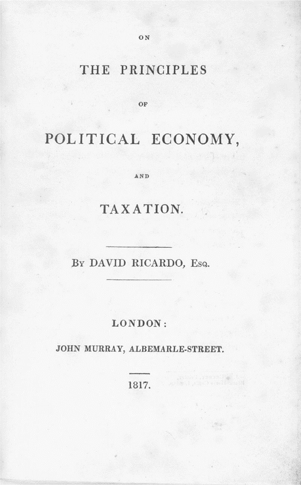{width=300}
:::
::::


## De quoi le commerce-est-il le nom ?

:::: {.columns}
::: {.column width="70%" .r-fit-text}
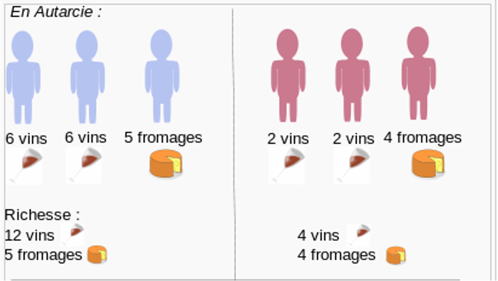{width=700}
:::
::: {.column width="30%" .r-fit-text}
{width=200}
:::
::::


:::: {.columns}
::: {.column width="35%" .r-fit-text}
Le pays A dispose d’un avantage absolu en matière de productivité journalière, aussi bien pour le vin que pour le fromage.
:::
::: {.column width="35%" .r-fit-text}
Le pays B dispose d’un avantage comparatif plus important pour le fromage que pour le vin.
:::
::::


## De quoi le commerce-est-il le nom ?

:::: {.columns}
::: {.column width="70%" .r-fit-text}
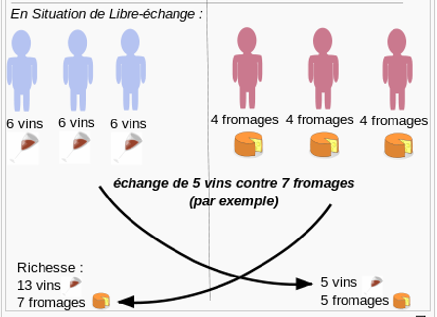{width=800}
:::
::: {.column width="30%" .r-fit-text}
**THEORIE DU LIBRE ECHANGE** : Si chaque pays se spécialise dans la production où il est le plus performant ou le moins contre-performant (*avantage comparatif*) et s’il échange avec l’autre pays sa production chacun est théoriquement gagnant… 
:::
::::


## Un débat ancien ...


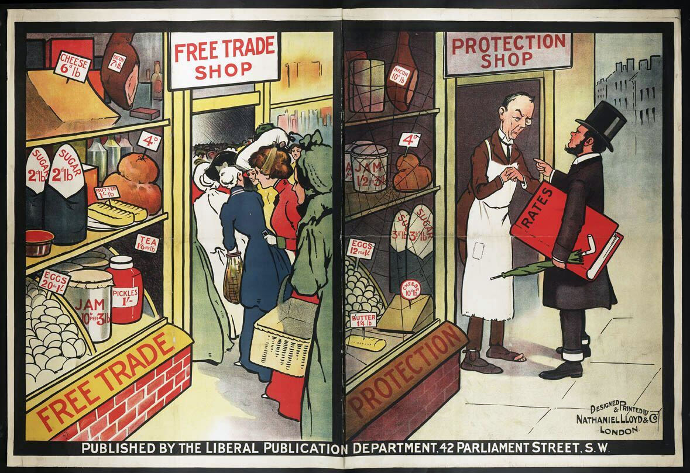{width=800}

- Source : [Affiche anglaise (1910)](https://commons.wikimedia.org/wiki/File:Free_Trade_and_Protection.jpg)

## Un débat ancien ...


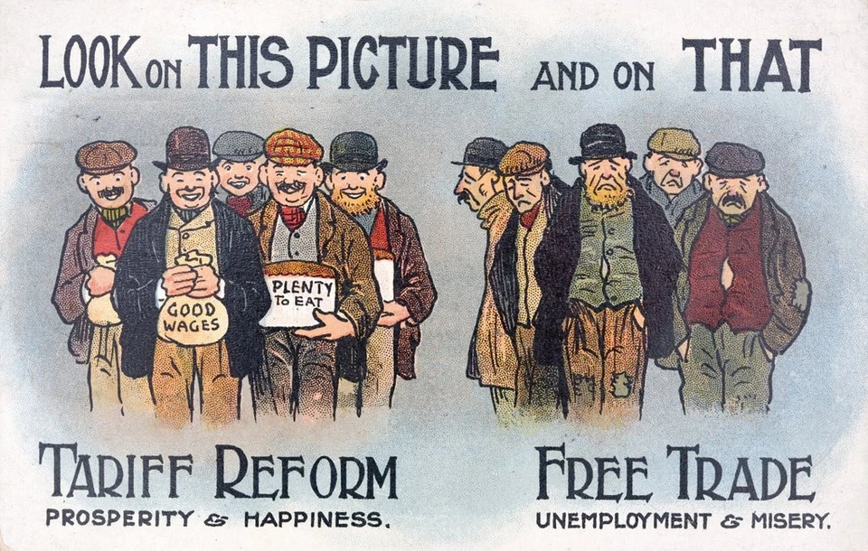{width=800}

- Source : [Carte postale anglaise (1910)](https://commons.wikimedia.org/wiki/File:Free_Trade_and_Protection.jpg)


## Le rejet du traité transatlantique (2013)

:::: {.columns}
::: {.column width="50%" .r-fit-text}
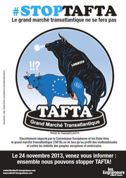{width=400}
:::
::: {.column width="50%" .r-fit-text}
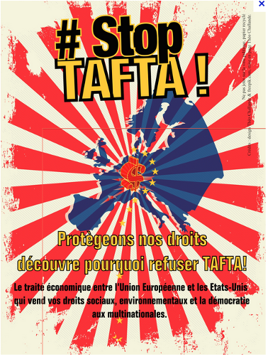{width=400}
:::
::::

## La signature de l'accord UE-Mercosur (2026 ?)

:::: {.columns}
::: {.column width="50%" .r-fit-text}
{width=200}

- source : [Commission Européenne, 2026](https://www.instagram.com/reel/DTliPgQDOdU/)
:::
::: {.column width="50%" .r-fit-text}
{width=400}

- source : [Left Party, Parlement Européen 2025](https://left.eu/issues/eu-mercosur-free-trade-deal-explainer-a-bad-trade-for-farmers-people-and-climate/)
:::
::::


# PUISSANCE COMMERCIALE DES PAYS DU MONDE EN 2019


```{r}
### NEW VERSION ###
trade <- readRDS("data2/trade5years.RDS") %>% filter(t5=="2016-20")
trade<-data.table(trade) %>% filter(is.na(Fijt)==F) %>% mutate(i=substr(i,1,3))


tab<-trade[,list(nb=.N, exp = sum(Fijt,na.rm=T)/1000000 ,imp = sum(Fjit,na.rm=T)/1000000),.(i)] 
tab$exp_pct<-100*tab$exp/sum(tab$exp)
tab$imp_pct<-100*tab$imp/sum(tab$imp)
tab$vol_pct<-(tab$exp_pct+tab$imp_pct)/2
tab$sol_pct<-(tab$exp_pct-tab$imp_pct)
tab$vol_rnk<-rank(-tab$vol_pct)
tab<-tab[order(tab$vol_rnk),]
tot<-tab

map<-readRDS("data2/wb_map_high.Rdata")
name<-st_drop_geometry(map) %>% select(i=iso3c,country=name)

tot <- merge(tot,name,by="i",all.x=F,all.y=F)


# Join GDP 
tot2<-readRDS("data2/wb_don_1990_2019.Rdata")
tot2<-tot2 %>% filter(date %in% c(2015,2016, 2017,2018,2019)) %>% 
               select(i=iso3c, GDP, TOT_rnk) %>% 
               mutate(GDP=GDP/1000000000,WPI=TOT_rnk)%>%
               group_by(i) %>%
              summarise(GDP=mean(GDP,na.rm=T),WPI=min(WPI)) %>% filter(is.na(GDP)==F)

tot2<-merge(tot,tot2, by="i", all.x=F,all.y=T)

write.table(tot2,"data2/trade2016-20.csv", row.names = FALSE, sep=";")
```


## Origine des données

::: {.column width="100%" .r-fit-text}
Nous avons utilisé la base de données gravity du CEPII qui fournit une base historique du commerce des pays du Monde de 1967 à aujourd'hui. On utilisera comme date la plus récente la période **2016-2020**.

- Ces données sont accessibles librement sur le site du CEPII [par ce lien](https://www.cepii.fr/CEPII/fr/bdd_modele/bdd_modele_item.asp?id=8) 
- Elles comporte les pays contestés, notamment Taiwan ou le Kosovo.
- Elles décompose certains états (e.g. Chine/TaiWan/Macao)
- Pour les croisements avec le PIB nous avons utilisé ldes données de la banque Mondiale
:::

## Exportations 2016-20 (top 20)

```{r}

don<-tot %>% mutate(rang = rank(-exp)) %>%
             select(code=i, pays=country, rang=rang, valeur=exp,pct = exp_pct)%>%

              arrange(rang) %>%
              mutate(cumpct=cumsum(pct))

        

set_flextable_defaults(
  digits = 1,
  decimal.mark = ",",
  big.mark = " ",
  na_str = "<na>"
)

top<-flextable(don[1:20,]) %>% 
     colformat_double() %>%
      colformat_double(j=c("rang","valeur"),digits=0) %>%
     theme_vanilla() %>%
     fontsize(size = 16) 
autofit(top)


```

## Exportations 2016-20 (carte)

```{r}
   
      mapdon<-merge(map,don,by.x="iso3c",by.y="code",all.x=T,all.y=F)
      mapdon$sizegroup<-cut(mapdon$pct,c(0,0.1, 0.2,0.5,1,2,5,10,20,100))
      levels(mapdon$sizegroup)<-c("< 0.1%","0.1-0.2","0.2-0.5","0.5-1","1-2","2-5","5-10","10-20",">20")

    
   
      g <- list(showframe = TRUE,
                framecolor= toRGB("gray50"),
                coastlinecolor = toRGB("black"),
                showland = TRUE,
                landcolor = toRGB("gray90"),
                showcountries = TRUE,
                countrycolor = toRGB("black"),
                countrywidth = 0.2,
           #     projection = list(type = 'azimuthal equidistant'))
                projection = list(type = 'robinson'))
      
      p<- plot_geo(mapdon, width=1000, height = 700) %>%
        add_markers(x = ~Lon,
                    y = ~Lat,
                    sizes = c(0, 1000),
                    size = ~pct,
                    color= ~sizegroup,
                 #   colors= c("red","orange","yellow","green","blue"),
                    colors = rev(brewer.pal(9,"Spectral")),
                    hoverinfo = "text",
                  text = ~paste('ISO3 Code   : ', iso3c,
                                  '<br /> Country name: ', pays,
                                  '<br /> World share (%) : ',round(pct,3),
                                  '<br /> World rank      : ',round(rang,0))) %>%
        layout(geo = g)
      p
    
```

## Importations 2016-20 (top 20)

```{r}

don<-tot %>% mutate(rang = rank(-imp)) %>%
             select(code=i, pays=country, rang=rang, valeur=imp,pct = imp_pct)%>%

              arrange(rang) %>%
              mutate(cumpct=cumsum(pct))
       
set_flextable_defaults(
  digits = 1,
  decimal.mark = ",",
  big.mark = " ",
  na_str = "<na>"
)

top<-flextable(don[1:20,]) %>% 
     colformat_double() %>%
      colformat_double(j=c("rang","valeur"),digits=0) %>%
     theme_vanilla() %>%
     fontsize(size = 16) 
autofit(top)

```

## Importations 2016-20 (carte)

```{r}
   
      mapdon<-merge(map,don,by.x="iso3c",by.y="code",all.x=T,all.y=F)
      mapdon$sizegroup<-cut(mapdon$pct,c(0,0.1, 0.2,0.5,1,2,5,10,20,100))
      levels(mapdon$sizegroup)<-c("< 0.1%","0.1-0.2","0.2-0.5","0.5-1","1-2","2-5","5-10","10-20",">20")

    
   
      g <- list(showframe = TRUE,
                framecolor= toRGB("gray50"),
                coastlinecolor = toRGB("black"),
                showland = TRUE,
                landcolor = toRGB("gray90"),
                showcountries = TRUE,
                countrycolor = toRGB("black"),
                countrywidth = 0.2,
           #     projection = list(type = 'azimuthal equidistant'))
                projection = list(type = 'robinson'))
      
      p<- plot_geo(mapdon, width=1000, height = 700) %>%
        add_markers(x = ~Lon,
                    y = ~Lat,
                    sizes = c(0, 1000),
                    size = ~pct,
                    color= ~sizegroup,
                 #   colors= c("red","orange","yellow","green","blue"),
                    colors = rev(brewer.pal(9,"Spectral")),
                    hoverinfo = "text",
                  text = ~paste('ISO3 Code   : ', iso3c,
                                  '<br /> Country name: ', pays,
                                  '<br /> World share (%) : ',round(pct,3),
                                  '<br /> World rank      : ',round(rang,0))) %>%
        layout(geo = g)
      p
    
```

## Volume 2016-20 (top 20)

```{r}

don<-tot %>% mutate(vol=imp+exp, rang = rank(-vol)) %>%
             select(code=i, pays=country, rang=rang, valeur=vol,pct = vol_pct)%>%

              arrange(rang) %>%
              mutate(cumpct=cumsum(pct))
         

set_flextable_defaults(
  digits = 1,
  decimal.mark = ",",
  big.mark = " ",
  na_str = "<na>"
)

top<-flextable(don[1:20,]) %>% 
     colformat_double() %>%
      colformat_double(j=c("rang","valeur"),digits=0) %>%
     theme_vanilla() %>%
     fontsize(size = 16) 
autofit(top)

```

## Volume 2016-20 (carte)

```{r}
   
      mapdon<-merge(map,don,by.x="iso3c",by.y="code",all.x=T,all.y=F)
      mapdon$sizegroup<-cut(mapdon$pct,c(0,0.1, 0.2,0.5,1,2,5,10,20,100))
      levels(mapdon$sizegroup)<-c("< 0.1%","0.1-0.2","0.2-0.5","0.5-1","1-2","2-5","5-10","10-20",">20")

    
   
      g <- list(showframe = TRUE,
                framecolor= toRGB("gray50"),
                coastlinecolor = toRGB("black"),
                showland = TRUE,
                landcolor = toRGB("gray90"),
                showcountries = TRUE,
                countrycolor = toRGB("black"),
                countrywidth = 0.2,
           #     projection = list(type = 'azimuthal equidistant'))
                projection = list(type = 'robinson'))
      
      p<- plot_geo(mapdon, width=1000, height = 700) %>%
        add_markers(x = ~Lon,
                    y = ~Lat,
                    sizes = c(0, 1000),
                    size = ~pct,
                    color= ~sizegroup,
                 #   colors= c("red","orange","yellow","green","blue"),
                    colors = rev(brewer.pal(9,"Spectral")),
                    hoverinfo = "text",
                  text = ~paste('ISO3 Code   : ', iso3c,
                                  '<br /> Country name: ', pays,
                                  '<br /> World share (%) : ',round(pct,3),
                                  '<br /> World rank      : ',round(rang,0))) %>%
        layout(geo = g)
      p
    
```

## Solde 2016-20 (top 10 des gagnants et des perdants)

```{r}

don<-tot %>% mutate(solde=exp-imp, rang = rank(solde), volume = exp+imp, tx_couverture=100*exp/imp) %>%
             select(code=i, pays=country, export= exp, import=imp,volume, solde, solde_pct = sol_pct,rang)%>%
             arrange(rang) 
         
sela<-don[1:10,]
don<-don %>% arrange(-rang)
selb<-don[1:10]
sel<-rbind(sela,selb) %>% arrange(-rang) %>% select(-rang,-solde_pct)


set_flextable_defaults(
  digits = 1,
  decimal.mark = ",",
  big.mark = " ",
  na_str = "<na>"
)

top<-flextable(sel) %>% 
     colformat_double(digits=0) %>%
  #    colformat_double(j=c("rang","valeur"),digits=0) %>%
     color(color = "red",i = ~ solde < 0  ) %>%
     theme_vanilla() %>%
     fontsize(size = 16) 
autofit(top)


```

## Solde 2016-20 (carte)

```{r}
   
      mapdon<-merge(map,don,by.x="iso3c",by.y="code",all.x=T,all.y=F)

      mapdon$sizegroup<-cut(mapdon$solde_pct,c(-100,0,100))
      mapdon$abs_pct<-abs(mapdon$solde_pct)
      levels(mapdon$sizegroup)<-c("Déficit","Excédent")
     
   
      g <- list(showframe = TRUE,
                framecolor= toRGB("gray50"),
                coastlinecolor = toRGB("black"),
                showland = TRUE,
                landcolor = toRGB("gray90"),
                showcountries = TRUE,
                countrycolor = toRGB("black"),
                countrywidth = 0.2,
           #     projection = list(type = 'azimuthal equidistant'))
                projection = list(type = 'robinson'))
      
      p<- plot_geo(mapdon, width=1000, height = 800) %>%
        add_markers(x = ~Lon,
                    y = ~Lat,
                    sizes = c(0, 1000),
                    size = ~abs_pct,
                    color= ~sizegroup,
                    colors= c("red","blue"),
                 #   colors = rev(brewer.pal(9,"Spectral")),
                    hoverinfo = "text",
                  text = ~paste('ISO3 Code   : ', iso3c,
                                  '<br /> Country name: ', pays,
                                  '<br /> Export (Billions $) : ',round(export,0),
                                  '<br /> Import (Billions $) : ',round(import,0),
                                  '<br /> Volume (Billions $) : ',round(volume,0),
                                  '<br /> Solde (Billions $) : ',round(solde,0))) %>%
        layout(geo = g)
      p
    
```


## Vulnérabilité face aux chocs internationaux


::: {.column width="100%" .r-fit-text}
La vulnérabilité d'un pays face aux chocs internationaux se mesure à travers la mise en rapport des exportations ou des importations par rapport au PIB. On retiendra ici deux indicateurs :


- **VULNERABILITE = Volume des échanges / PIB** : cet indicateur est une mesure de l'**insertion du pays dans l'économie mondiale**. Plus le rapport est élevé, plus il met en évidence un pays tourné vers des marchés extérieurs, que ce soit en termes d'importation ou d'exportation.

- **IMPACT = Solde des échanges / PIB** : cet indicateur mesure de la **contribution des échanges commerciaux à la croissance économique du pays**. Une valeur positive signifie que le commerce contribue à l'augmentation de la richesse nationale, Une valeur négative indique au contraire que le commerce appauvrit le pays en raison d'une balance déséqulibrée. 
:::


## Vulnérabilité 2016-20

```{r}


don<-tot2 %>% mutate(code=i, pays=country, rang_PIB = rank(-GDP),export=exp,import=imp,volume=import+export, solde=export-import, PIB = GDP, VULNERABILITE=100*volume/PIB, IMPACT = 100*solde/PIB) %>%
              select(code,pays,rang_PIB, PIB, volume,solde,VULNERABILITE,IMPACT)%>%
             arrange(-PIB) 
         

mypal<-rev(brewer.pal(5,"RdYlGn"))


top<-flextable(don[1:60,]) %>% 
     colformat_double(digits=0) %>%
      colformat_double(digits=1, j=c("VULNERABILITE","IMPACT")) %>%
    bg(bg = mypal[1], i = ~ VULNERABILITE < 20 ) %>%
      bg(bg = mypal[2], i = ~ VULNERABILITE > 20 ) %>%
      bg(bg = mypal[3], i = ~ VULNERABILITE > 40 ) %>%
        bg(bg = mypal[4], i = ~ VULNERABILITE > 60 ) %>%
        bg(bg = mypal[5], i = ~ VULNERABILITE > 80 ) %>%
     theme_vanilla() %>%
     fontsize(size = 16) 
autofit(top)

```


## Vulnérabilité 2016-20

```{r}
   
      mapdon<-merge(map,don,by.x="iso3c",by.y="code",all.x=T,all.y=F)
      mapdon$pct<-100*mapdon$volume/sum(mapdon$volume,na.rm=T)
      mapdon$sizegroup<-cut(mapdon$VULNERABILITE,c(0, 20,40,60,80,10000))
      levels(mapdon$sizegroup)<-c("0-20","20-40","40-60","60-80",">80")

    
   
      g <- list(showframe = TRUE,
                framecolor= toRGB("gray50"),
                coastlinecolor = toRGB("black"),
                showland = TRUE,
                landcolor = toRGB("gray90"),
                showcountries = TRUE,
                countrycolor = toRGB("black"),
                countrywidth = 0.2,
           #     projection = list(type = 'azimuthal equidistant'))
                projection = list(type = 'robinson'))
      
      p<- plot_geo(mapdon, width=1000, height = 500) %>%
        add_markers(x = ~Lon,
                    y = ~Lat,
                    sizes = c(0, 1000),
                    size = ~pct,
                    color= ~sizegroup,
                 #   colors= c("red","orange","yellow","green","blue"),
                    colors = rev(brewer.pal(5,"RdYlGn")),
                    hoverinfo = "text",
                  text = ~paste('ISO3 Code   : ', iso3c,
                                  '<br /> Country name: ', pays,
                                  '<br /> Trade share (%) : ',round(pct,3),
                                  '<br /> Trade vulnerability : ',round(VULNERABILITE,0))) %>%
        layout(geo = g)
      p
   
```

## Conclusion de la première partie
::: {.column width="100%" .r-fit-text}
1. Les échanges commerciaux sont distribués de façon très **inégalitaire** dans le monde. Les pays les plus riches sont en général ceux qui participent le plus aux échanges.

2. La balance des échanges est souvent déséquilibrée, ce qui conduit à l'apparition de **gagnants** et de **perdants**. On note en particulier le déséquilibre majeur qui existe entre les **Etats-Unis** et la **Chine** et qui explique une partie des tensions entre les deux pays. 

3. Certains pays sont plus insérés que d'autres dans les échanges mondiaux, ce qui entraîne une **vulnérabilité face aux chocs internationaux**. Les grands pays (**Etats-Unis**, la **Chine**, l'**Inde**, le **Brésil** ou la **Russie**)  sont en général moins vulnérables que les petits pays car ils ont un vaste marché intérieur

4. L'importance commerciale des pays membres de l'**Union Européenne** ainsi que leur vulnérabilité est surestimée** car une bonne partie de leurs échanges se font les uns avec les autres.
:::


# GEOPOLIIQUE DES ECHANGES COMMERCIAUX D

## Hard ou Soft power ?

Le commerce relève à la fois du soft power et du hard power.

- **Soft Power** : la diffusion de produits commerciaux est associée à la diffusion de pratiques culturelles, de valeurs, de modèles de développement. 
- **Hard Power** : les décisions de boycott et d'embargo peuvent déséquilibrer l'économie du pays le moins puissant qui subit un choc. 

## Le modèle des flux dominants

Mis au point par Nyusten & Dacey pour étudier la hiérarchie urbaine à l'aide des flux téléphoniques, cette méthode peut être transposée à l'étude géopolitique des relations commerciales. Dans sa version initiale elle se formule par la règle suivante :

Un pays i est dominé par un pays j si :

1. i envoie sont plus grand flux bilateral vers j
2. le volume des échanges de i est inférieur à celui de j


## Le modèle des flux dominants
:::: {.columns}

::: {.column width="50%" }
### Echanges bilatéraux

```{mermaid}

flowchart TD
    A["pays A
    Volume = 200"]
    B["pays B
    Volume=100"]
    C["pays C
    Volume = 80"]
    D["Pays D
    Volume=50"]
    E["Pays E,
    Volume = 60"]
    
    A-- 20 ---B
    A-- 10 ---C
    A-- 15 ---D
    A-- 5 ---E
    B-- 15 ---C
    B-- 5 ---D
    B-- 5 ---E
    C-- 5 ---D
    C-- 5 ---E
    D-- 10 ---E

```
:::


::: {.column width="50%"}
### Qui domine qui ?
- A : 
- B : 
- C : 
- D : 
- E : 
:::

::::


## Le modèle des flux dominants
:::: {.columns}

::: {.column width="50%" }
### Echanges bilatéraux

```{mermaid}

flowchart TD
    A["pays A
    Volume = 200"]
    B["pays B
    Volume=100"]
    C["pays C
    Volume = 80"]
    D["Pays D
    Volume=50"]
    E["Pays E,
    Volume = 60"]
    

    A--> A
    B--> A
    C--> B
    D--> A
    E--> E

```
:::


::: {.column width="50%"}
### Qui domine qui ?

- A n'est pas dominé et domine  A et B (**Dominant**)
- B est dominé par A et domine C (**Relais**)
- C est dominé par B (**Dominé**)
- D est dominé par A (**Dominé**)
- E n'est pas dominé mais ne domine personne (**Isolé**)

:::

::::

## Après la colonisation (1966-75)

### 200 premiers flux

```{r}

### Mise à jour ###
grav<-readRDS("data2/trade5years.RDS")
grav<-as.data.frame(grav)

### Matrice de flux
tab<-grav %>% filter(t5 %in% c("1966-70","1971-75"), is.na(Fijt)==F, is.na(Fjit)==F) %>%
          group_by(i,j) %>%
         summarise(Fij=sum(Fijt)+sum(Fjit))
tab<-as.data.frame(tab)

mat<-Col_Mat(tab)
mat<-Mat_Clean(mat)
mat<-Mat_Norm(mat,norm=1000000,dig=0)


## Fonds de carte associé
world_map<-readRDS("data2/gravitymap_V5.rds") %>%
      filter(country_id %in% colnames(mat)) %>% st_make_valid() %>% unique() %>% mutate(ISO3 = country_id) %>% select(ISO3)
world_ctr<-st_centroid(world_map,of_largest_polygon = T)
world_ctr<-unique(world_ctr)
world_ctr$geometry[world_ctr$ISO3=="SUN"]<-st_point(c(38,56))


# Project : Lambert Azimuthal - center = Paris
world_ctr = st_transform(world_ctr, 
                           crs = "+proj=laea +x_0=0 +y_0=0 +lon_0=2 +lat_0=49")

world_ctr$geometry[world_ctr$ISO3=="RUS"]
world_map= st_transform(world_map, 
                           crs = "+proj=laea +x_0=0 +y_0=0 +lon_0=2 +lat_0=49")


```


```{r}
net<- Mat_Col(mat)
 
# Prepare links
links <- net %>% mutate(pct=Fij/10000) %>% arrange(-pct) %>% slice(1:400)
world_links2 <- mf_get_links(x = world_ctr, df = links)


# prepare nodes 
nodes <- net %>% mutate(pct=Fij/10000) %>%
                group_by(i) %>% 
                summarise(pct=sum(pct)) %>% 
                select(ISO3=i, pct = pct)
world_nodes2 <- left_join(world_ctr,nodes)


# Initiate a base map
mf_map(x = world_map, theme ="dark")

# Plot a shadow
mf_shadow(world_map, add = TRUE,cex = 0.3, col = "gray80")

# Plot empty map
mf_map(world_map, type = "base", add = TRUE, border= "white", lwd=0.3)

mycol1<-alpha("red",0.5)


# Plot links
mf_map(world_links2, 
       type = "prop",
       var = "pct",
       leg_pos = "topleft",
       leg_title = "Flux (%)",
       leg_val_rnd = 1,
       col=mycol1,
       alpha=0.5,
       add=T)

# Plot nodes
mf_map(world_nodes2, 
       type = "prop",
       var = "pct",
       inches = 0.1,
       col = "yellow",
       border= "red",
       leg_pos = "topright",
       leg_title = "Volume (%)",
       leg_val_rnd = 1,
       add=T)


# layout
mf_layout(title = "300 premiers flux",
          scale = FALSE,
          arrow=FALSE,
          frame=T,
         credits = "Source : Gravity database - CEPII")


```


## Après la colonisation (1966-75)


```{r}


#mat<-t(mat)+mat
col<-Mat_Col(mat)
col2<-Col_Sel(col,0.01,0.01) %>% filter(i !="_rest_", j != "_rest_")
dom2<-Col_Dom(col2)
net<-Viz_Dom(dom2, mytitle = "Graphe des flux dominants", mysub="Source : Gravity database - CEPII")
net
```

## Après la colonisation (1966-75)


```{r}


net<- Mat_Col(mat)
 
# Prepare links
links <- net %>% mutate(Fij=Fij/10000) %>% arrange(-Fij) 
world_links2 <- mf_get_links(x = world_ctr, df = links)


# prepare nodes 
nodes <- net %>% mutate(Fij=Fij/10000) %>%
                group_by(i) %>% 
                summarise(pct=sum(Fij)) %>% 
                select(ISO3=i, pct = pct)
world_nodes2 <- left_join(world_ctr,nodes)


###### FLUX DOMINANTS ###


flows_to_dom<-function (flows=flows) 
  {
flowi<-flows%>%group_by(i)%>%summarise(Fi=sum(Fij))%>%ungroup()
flowj<-flows%>%group_by(j)%>%summarise(Fj=sum(Fij))%>%ungroup()
flows<- flows%>%left_join(flowi)%>%left_join(flowj)   
dom <- flows%>%arrange(desc(Fi))%>%
            arrange(desc(Fij))%>%
            arrange(desc(Fj))%>%
            group_by(j)%>%
            mutate(dom=row_number())%>%
            ungroup()%>%
           filter(dom==1)%>%
            filter(Fi>Fj )
 return(dom) 
}
dom<-flows_to_dom(net)


dom1<-dom %>% select(i,Fi) %>% unique()
dom2<-dom %>% select(j,Fj) %>% unique()
domA <- dom1 %>% filter(!i %in% dom2$j) %>% rename (ISO3=i, link=Fi) %>% mutate(type = "1.Dominant") 
domB <- dom1 %>% filter(i %in% dom2$j)  %>% rename (ISO3=i, link=Fi) %>% mutate(type = "2.Relais")
domC <- dom2 %>% filter(!j %in% dom1$i) %>% rename (ISO3=j, link=Fj) %>% mutate(type = "3.Dominé")
dom_type<-rbind(domA,domB,domC)


world_nodes2<-merge(world_ctr,dom_type,by="ISO3")


world_links <- mf_get_links(x = world_ctr, df = dom[,1:3])

world_links2 <- world_links %>% filter(Fij >10) 

## Define worldregions

regio<-dom_type
  listdom<-domA$ISO3
  netlink1<-dom[,c("i","j")]
  netlink2<-data.frame(i=listdom, j=listdom)
  netlink<-rbind(netlink1,netlink2)
  # step1
  names(netlink)<-c("reg1","ISO3")
regio<-left_join(regio, netlink)  

  # step2
  names(netlink)<-c("reg2","reg1")
  regio<-left_join(regio, netlink)  

  # step3
  names(netlink)<-c("reg3","reg2")
  regio<-left_join(regio, netlink)  

   # step4
  names(netlink)<-c("reg4","reg3")
  regio<-left_join(regio, netlink)  

  # step5
  names(netlink)<-c("reg5","reg4")
  regio<-left_join(regio, netlink)  
 
  # Final region
  
  regio$reg<-as.factor(regio$reg5)

  
#table(regio$reg)

  levels(regio$reg)<-c("Allemagne","Singapour","Union Soviétique","Etats-Unis")

# Link with worldmap
  world_map2<-merge(world_map, regio, by="ISO3", all.x=T, all.y=F)


# import the sample data set
# Initiate a base map

mf_map(x = world_map)

# Plot a shadow
mf_shadow(world_map, add = TRUE,cex = 0.3, col = "white")

# Plot regions
mf_map(world_map2,
       var = "reg",
       type = "typo",
       add = TRUE,
       border= "white",
       pal=c("blue","orange","red","green"),
       alpha=0.5,
       lwd=0.6,
       col_na = "gray80",leg_no_data = "Autres regions (< 4)",
       leg_title = "Régions nodales",
       leg_pos = "bottomleft")


# Plot links
mf_map(world_links, 
       col = "black", 
       type = "grad", 
       var = "Fij",
       leg_pos = "topleft",
       leg_val_rnd = 0,
       border=NA,
       leg_title = "Force du lien",
       breaks = c(1,10,100,1000, 10000,max(world_links$Fij)),
#       lwd=c(0.25,0.5,1,1.5,2,2.5,3,3.5),
      lwd=c(0.1,0.2,0.4,0.8,1),
       add = TRUE)


# plot nodes by type and size
mf_prop_typo(
  x = world_nodes2, 
  var = c("link", "type"), 
#  inches = .07, 
  inches = .05, 
  border = "gray20",
  symbol = "square", 
  col_na = "grey", 
  pal = c("black","gray","white"),
#  lwd = 0.3,
  lwd = 0.6,
  leg_pos = c("topright","bottomright"),
  leg_title = c("Somme des liens", "Types de noeuds"),
  leg_title_cex = c(0.7, 0.7),
  leg_val_rnd = 0,
  leg_val_cex = c(.5, .7),
  val_order = c("1.Dominant","2.Relais","3.Dominé"),
  leg_no_data = "No data",
  leg_frame = c(FALSE, FALSE),
  add = TRUE
)


# layout
mf_layout(title = "Régions nodales polarisées par les flux dominants",
          scale = FALSE,
          arrow=FALSE,
          frame=T,
         credits = "Source : Gravity database, CEPII, 2022")
```


## Après la Guerre Froide (1991-2000)

### 200 premiers flux

```{r}

### Mise à jour ###
grav<-readRDS("data2/trade5years.RDS")
grav<-as.data.frame(grav)
grav$i[grav$i=="SUN"]<-"RUS"
grav$j[grav$j=="SUN"]<-"RUS"

### Matrice de flux
tab<-grav %>% filter(t5 %in% c("1991-95","1996-00"), is.na(Fijt)==F, is.na(Fjit)==F, i!=j) %>%
          group_by(i,j) %>%
         summarise(Fij=sum(Fijt)+sum(Fjit))
tab<-as.data.frame(tab)

mat<-Col_Mat(tab)
mat<-Mat_Clean(mat)
mat<-Mat_Norm(mat,norm=1000000,dig=0)


## Fonds de carte associé
world_map<-readRDS("data2/gravitymap_V5.rds") %>%
      filter(country_id %in% colnames(mat)) %>% st_make_valid() %>% unique() %>% mutate(ISO3 = country_id) %>% select(ISO3)
world_ctr<-st_centroid(world_map,of_largest_polygon = T)
world_ctr<-unique(world_ctr)
world_ctr$geometry[world_ctr$ISO3=="SUN"]<-st_point(c(38,56))


# Project : Lambert Azimuthal - center = Paris
world_ctr = st_transform(world_ctr, 
                           crs = "+proj=laea +x_0=0 +y_0=0 +lon_0=2 +lat_0=49")

world_ctr$geometry[world_ctr$ISO3=="RUS"]
world_map= st_transform(world_map, 
                           crs = "+proj=laea +x_0=0 +y_0=0 +lon_0=2 +lat_0=49")


```


```{r}
net<- Mat_Col(mat)
 
# Prepare links
links <- net %>% mutate(pct=Fij/10000) %>% arrange(-pct) %>% slice(1:400)
world_links2 <- mf_get_links(x = world_ctr, df = links)


# prepare nodes 
nodes <- net %>% mutate(pct=Fij/10000) %>%
                group_by(i) %>% 
                summarise(pct=sum(pct)) %>% 
                select(ISO3=i, pct = pct)
world_nodes2 <- left_join(world_ctr,nodes)


# Initiate a base map
mf_map(x = world_map, theme ="dark")

# Plot a shadow
mf_shadow(world_map, add = TRUE,cex = 0.3, col = "gray80")

# Plot empty map
mf_map(world_map, type = "base", add = TRUE, border= "white", lwd=0.3)

mycol1<-alpha("red",0.5)


# Plot links
mf_map(world_links2, 
       type = "prop",
       var = "pct",
       leg_pos = "topleft",
       leg_title = "Flux (%)",
       leg_val_rnd = 1,
       col=mycol1,
       alpha=0.5,
       add=T)

# Plot nodes
mf_map(world_nodes2, 
       type = "prop",
       var = "pct",
       inches = 0.1,
       col = "yellow",
       border= "red",
       leg_pos = "topright",
       leg_title = "Volume (%)",
       leg_val_rnd = 1,
       add=T)


# layout
mf_layout(title = "200 premiers flux",
          scale = FALSE,
          arrow=FALSE,
          frame=T,
         credits = "Source : Gravity database - CEPII")


```


## Après la Guerre Froide (1991-2000)


```{r}


#mat<-t(mat)+mat
col<-Mat_Col(mat)
col2<-Col_Sel(col,0.01,0.01) %>% filter(i !="_rest_", j != "_rest_")
dom2<-Col_Dom(col2)
net<-Viz_Dom(dom2, mytitle = "Graphe des flux dominants", mysub="Source : Gravity database - CEPII")
net
```

## Après la Guerre Froide (1991-2000)


```{r}


net<- Mat_Col(mat)
 
# Prepare links
links <- net %>% mutate(Fij=Fij/10000) %>% arrange(-Fij) 
world_links2 <- mf_get_links(x = world_ctr, df = links)


# prepare nodes 
nodes <- net %>% mutate(Fij=Fij/10000) %>%
                group_by(i) %>% 
                summarise(pct=sum(Fij)) %>% 
                select(ISO3=i, pct = pct)
world_nodes2 <- left_join(world_ctr,nodes)


###### FLUX DOMINANTS ###


flows_to_dom<-function (flows=flows) 
  {
flowi<-flows%>%group_by(i)%>%summarise(Fi=sum(Fij))%>%ungroup()
flowj<-flows%>%group_by(j)%>%summarise(Fj=sum(Fij))%>%ungroup()
flows<- flows%>%left_join(flowi)%>%left_join(flowj)   
dom <- flows%>%arrange(desc(Fi))%>%
            arrange(desc(Fij))%>%
            arrange(desc(Fj))%>%
            group_by(j)%>%
            mutate(dom=row_number())%>%
            ungroup()%>%
           filter(dom==1)%>%
            filter(Fi>Fj )
 return(dom) 
}
dom<-flows_to_dom(net)


dom1<-dom %>% select(i,Fi) %>% unique()
dom2<-dom %>% select(j,Fj) %>% unique()
domA <- dom1 %>% filter(!i %in% dom2$j) %>% rename (ISO3=i, link=Fi) %>% mutate(type = "1.Dominant") 
domB <- dom1 %>% filter(i %in% dom2$j)  %>% rename (ISO3=i, link=Fi) %>% mutate(type = "2.Relais")
domC <- dom2 %>% filter(!j %in% dom1$i) %>% rename (ISO3=j, link=Fj) %>% mutate(type = "3.Dominé")
dom_type<-rbind(domA,domB,domC)


world_nodes2<-merge(world_ctr,dom_type,by="ISO3")


world_links <- mf_get_links(x = world_ctr, df = dom[,1:3])

world_links2 <- world_links %>% filter(Fij >10) 

## Define worldregions

regio<-dom_type
  listdom<-domA$ISO3
  netlink1<-dom[,c("i","j")]
  netlink2<-data.frame(i=listdom, j=listdom)
  netlink<-rbind(netlink1,netlink2)
  # step1
  names(netlink)<-c("reg1","ISO3")
regio<-left_join(regio, netlink)  

  # step2
  names(netlink)<-c("reg2","reg1")
  regio<-left_join(regio, netlink)  

  # step3
  names(netlink)<-c("reg3","reg2")
  regio<-left_join(regio, netlink)  

   # step4
  names(netlink)<-c("reg4","reg3")
  regio<-left_join(regio, netlink)  

  # step5
  names(netlink)<-c("reg5","reg4")
  regio<-left_join(regio, netlink)  
 
  # Final region
  
  regio$reg<-as.factor(regio$reg5)

  
table(regio$reg)

  levels(regio$reg)<-c("Chine","Allemagne","Etats-Unis")

# Link with worldmap
  world_map2<-merge(world_map, regio, by="ISO3", all.x=T, all.y=F)


# import the sample data set
# Initiate a base map

mf_map(x = world_map)

# Plot a shadow
mf_shadow(world_map, add = TRUE,cex = 0.3, col = "white")

# Plot regions
mf_map(world_map2,
       var = "reg",
       type = "typo",
       add = TRUE,
       border= "white",
       pal=c("yellow","blue","green"),
       alpha=0.5,
       lwd=0.6,
       col_na = "gray80",leg_no_data = "Autres regions (< 4)",
       leg_title = "Régions nodales",
       leg_pos = "bottomleft")


# Plot links
mf_map(world_links, 
       col = "black", 
       type = "grad", 
       var = "Fij",
       leg_pos = "topleft",
       leg_val_rnd = 0,
       border=NA,
       leg_title = "Force du lien",
       breaks = c(1,10,100,1000, 10000,max(world_links$Fij)),
#       lwd=c(0.25,0.5,1,1.5,2,2.5,3,3.5),
      lwd=c(0.1,0.2,0.4,0.8,1),
       add = TRUE)


# plot nodes by type and size
mf_prop_typo(
  x = world_nodes2, 
  var = c("link", "type"), 
#  inches = .07, 
  inches = .05, 
  border = "gray20",
  symbol = "square", 
  col_na = "grey", 
  pal = c("black","gray","white"),
#  lwd = 0.3,
  lwd = 0.6,
  leg_pos = c("topright","bottomright"),
  leg_title = c("Somme des liens", "Types de noeuds"),
  leg_title_cex = c(0.7, 0.7),
  leg_val_rnd = 0,
  leg_val_cex = c(.5, .7),
  val_order = c("1.Dominant","2.Relais","3.Dominé"),
  leg_no_data = "No data",
  leg_frame = c(FALSE, FALSE),
  add = TRUE
)


# layout
mf_layout(title = "Régions nodales polarisées par les flux dominants",
          scale = FALSE,
          arrow=FALSE,
          frame=T,
         credits = "Source : Gravity database, CEPII, 2022")
```


## Après la crise des subprimes (2011-2020)

### 200 premiers flux

```{r}

### Mise à jour ###
grav<-readRDS("data2/trade5years.RDS")
grav<-as.data.frame(grav)


### Matrice de flux
tab<-grav %>% filter(t5 %in% c("2010-15","2016-20"), is.na(Fijt)==F, is.na(Fjit)==F, i!=j) %>%
          group_by(i,j) %>%
         summarise(Fij=sum(Fijt)+sum(Fjit))
tab<-as.data.frame(tab)

mat<-Col_Mat(tab)
mat<-Mat_Clean(mat)
mat<-Mat_Norm(mat,norm=1000000,dig=0)


## Fonds de carte associé
world_map<-readRDS("data2/gravitymap_V5.rds") %>%
      filter(country_id %in% colnames(mat)) %>% st_make_valid() %>% unique() %>% mutate(ISO3 = country_id) %>% select(ISO3)
world_ctr<-st_centroid(world_map,of_largest_polygon = T)
world_ctr<-unique(world_ctr)
world_ctr$geometry[world_ctr$ISO3=="RUS"]<-st_point(c(38,56))


# Project : Lambert Azimuthal - center = Paris
world_ctr = st_transform(world_ctr, 
                           crs = "+proj=laea +x_0=0 +y_0=0 +lon_0=2 +lat_0=49")

world_ctr$geometry[world_ctr$ISO3=="RUS"]
world_map= st_transform(world_map, 
                           crs = "+proj=laea +x_0=0 +y_0=0 +lon_0=2 +lat_0=49")


```


```{r}
net<- Mat_Col(mat)
 
# Prepare links
links <- net %>% mutate(pct=Fij/10000) %>% arrange(-pct) %>% slice(1:400)
world_links2 <- mf_get_links(x = world_ctr, df = links)


# prepare nodes 
nodes <- net %>% mutate(pct=Fij/10000) %>%
                group_by(i) %>% 
                summarise(pct=sum(pct)) %>% 
                select(ISO3=i, pct = pct)
world_nodes2 <- left_join(world_ctr,nodes)


# Initiate a base map
mf_map(x = world_map, theme ="dark")

# Plot a shadow
mf_shadow(world_map, add = TRUE,cex = 0.3, col = "gray80")

# Plot empty map
mf_map(world_map, type = "base", add = TRUE, border= "white", lwd=0.3)

mycol1<-alpha("red",0.5)


# Plot links
mf_map(world_links2, 
       type = "prop",
       var = "pct",
       leg_pos = "topleft",
       leg_title = "Flux (%)",
       leg_val_rnd = 1,
       col=mycol1,
       alpha=0.5,
       add=T)

# Plot nodes
mf_map(world_nodes2, 
       type = "prop",
       var = "pct",
       inches = 0.1,
       col = "yellow",
       border= "red",
       leg_pos = "topright",
       leg_title = "Volume (%)",
       leg_val_rnd = 1,
       add=T)


# layout
mf_layout(title = "200 premiers flux",
          scale = FALSE,
          arrow=FALSE,
          frame=T,
         credits = "Source : Gravity database - CEPII")


```


## Après la crise des subprimes (2011-2020)


```{r}


#mat<-t(mat)+mat
col<-Mat_Col(mat)
col2<-Col_Sel(col,0.01,0.01) %>% filter(i !="_rest_", j != "_rest_")
dom2<-Col_Dom(col2)
net<-Viz_Dom(dom2, mytitle = "Graphe des flux dominants", mysub="Source : Gravity database - CEPII")
net
```

## Après la crise des subprimes (2011-2020)


```{r}


net<- Mat_Col(mat)
 
# Prepare links
links <- net %>% mutate(Fij=Fij/10000) %>% arrange(-Fij) 
world_links2 <- mf_get_links(x = world_ctr, df = links)


# prepare nodes 
nodes <- net %>% mutate(Fij=Fij/10000) %>%
                group_by(i) %>% 
                summarise(pct=sum(Fij)) %>% 
                select(ISO3=i, pct = pct)
world_nodes2 <- left_join(world_ctr,nodes)


###### FLUX DOMINANTS ###


flows_to_dom<-function (flows=flows) 
  {
flowi<-flows%>%group_by(i)%>%summarise(Fi=sum(Fij))%>%ungroup()
flowj<-flows%>%group_by(j)%>%summarise(Fj=sum(Fij))%>%ungroup()
flows<- flows%>%left_join(flowi)%>%left_join(flowj)   
dom <- flows%>%arrange(desc(Fi))%>%
            arrange(desc(Fij))%>%
            arrange(desc(Fj))%>%
            group_by(j)%>%
            mutate(dom=row_number())%>%
            ungroup()%>%
           filter(dom==1)%>%
            filter(Fi>Fj )
 return(dom) 
}
dom<-flows_to_dom(net)


dom1<-dom %>% select(i,Fi) %>% unique()
dom2<-dom %>% select(j,Fj) %>% unique()
domA <- dom1 %>% filter(!i %in% dom2$j) %>% rename (ISO3=i, link=Fi) %>% mutate(type = "1.Dominant") 
domB <- dom1 %>% filter(i %in% dom2$j)  %>% rename (ISO3=i, link=Fi) %>% mutate(type = "2.Relais")
domC <- dom2 %>% filter(!j %in% dom1$i) %>% rename (ISO3=j, link=Fj) %>% mutate(type = "3.Dominé")
dom_type<-rbind(domA,domB,domC)


world_nodes2<-merge(world_ctr,dom_type,by="ISO3")


world_links <- mf_get_links(x = world_ctr, df = dom[,1:3])

world_links2 <- world_links %>% filter(Fij >10) 

## Define worldregions

regio<-dom_type
  listdom<-domA$ISO3
  netlink1<-dom[,c("i","j")]
  netlink2<-data.frame(i=listdom, j=listdom)
  netlink<-rbind(netlink1,netlink2)
  # step1
  names(netlink)<-c("reg1","ISO3")
regio<-left_join(regio, netlink)  

  # step2
  names(netlink)<-c("reg2","reg1")
  regio<-left_join(regio, netlink)  

  # step3
  names(netlink)<-c("reg3","reg2")
  regio<-left_join(regio, netlink)  

   # step4
  names(netlink)<-c("reg4","reg3")
  regio<-left_join(regio, netlink)  

  # step5
  names(netlink)<-c("reg5","reg4")
  regio<-left_join(regio, netlink)  
 
  # Final region
  
  regio$reg<-as.factor(regio$reg5)

  
table(regio$reg)

  levels(regio$reg)<-c("Chine","Allemagne","Etats-Unis")

# Link with worldmap
  world_map2<-merge(world_map, regio, by="ISO3", all.x=T, all.y=F)


# import the sample data set
# Initiate a base map

mf_map(x = world_map)

# Plot a shadow
mf_shadow(world_map, add = TRUE,cex = 0.3, col = "white")

# Plot regions
mf_map(world_map2,
       var = "reg",
       type = "typo",
       add = TRUE,
       border= "white",
       pal=c("yellow","blue","green"),
       alpha=0.5,
       lwd=0.6,
       col_na = "gray80",leg_no_data = "Autres regions (< 4)",
       leg_title = "Régions nodales",
       leg_pos = "bottomleft")

# Plot links
mf_map(world_links, 
       col = "black", 
       type = "grad", 
       var = "Fij",
       leg_pos = "topleft",
       leg_val_rnd = 0,
       border=NA,
       leg_title = "Force du lien",
       breaks = c(1,10,100,1000, 10000,max(world_links$Fij)),
#       lwd=c(0.25,0.5,1,1.5,2,2.5,3,3.5),
      lwd=c(0.1,0.2,0.4,0.8,1),
       add = TRUE)


# plot nodes by type and size
mf_prop_typo(
  x = world_nodes2, 
  var = c("link", "type"), 
#  inches = .07, 
  inches = .05, 
  border = "gray20",
  symbol = "square", 
  col_na = "grey", 
  pal = c("black","gray","white"),
#  lwd = 0.3,
  lwd = 0.6,
  leg_pos = c("topright","bottomright"),
  leg_title = c("Somme des liens", "Types de noeuds"),
  leg_title_cex = c(0.7, 0.7),
  leg_val_rnd = 0,
  leg_val_cex = c(.5, .7),
  val_order = c("1.Dominant","2.Relais","3.Dominé"),
  leg_no_data = "No data",
  leg_frame = c(FALSE, FALSE),
  add = TRUE
)


# layout
mf_layout(title = "Régions nodales polarisées par les flux dominants",
          scale = FALSE,
          arrow=FALSE,
          frame=T,
         credits = "Source : Gravity database, CEPII, 2022")
```


## Volume bilateral d'échange 2016-20


```{r}
### Mise à jour ###
grav<-readRDS("data2/trade5years.RDS")
grav<-as.data.frame(grav)

### Flux totaux 2020
tab<-grav %>% filter(t5=="2016-20", is.na(Fijt)==F) %>%
           mutate(i=substr(i,1,3),j=substr(j,1,3))%>%
          group_by(i,j) %>%
         summarise(Fij=sum(Fijt)+sum(Fjit))
tab<-as.data.frame(tab)
mat<-Col_Mat(tab)
mat<-t(mat)+mat
col<-Mat_Col(mat)
col2<-Col_Sel(col,0.01,0.01) %>% filter(i !="_rest_", j != "_rest_")
dom2<-Col_Dom(col2)
net<-Viz_Dom(dom2, mytitle = "Flux dominants bilatéraux 2016-20", mysub="Source : Gravity database - CEPII")
net
```


## Montée en puissance de la Chine

- **en 1996-2000**, la Chine est un acteur mineur du commerce mondial à l'intérieur de la zone Asie Pacifique qui est dominée par les USA et le Japon.
- **en 2006-2010**, la Chine a déjà supplanté le Japon mais demeure dominée par les USA dans la zone Asie-Pacifique.
- **en 2016-2020**, la Chine domine désormais l'ensemble du commerce mondial, y compris la zone Europe-Russie-Méditerranée centrée sur l'Allemagne. 


## Variante I : exportations ou les importations ?

Le commerce bilatéral mélange deux formes de domination commerciale de nature différente : 

- **la domination des exportations** par les **pays importateurs** qui peuvent refuser d'acheter. 
- **la domination des importations** par les **pays exportateurs** qui peuvent refuser de vendre .

La carte des flux dominants est-elle la même dans les deux cas ?

## Domination des exportations en 2006

:::: {.columns}

::: {.column width="70%" .r-fit-text}
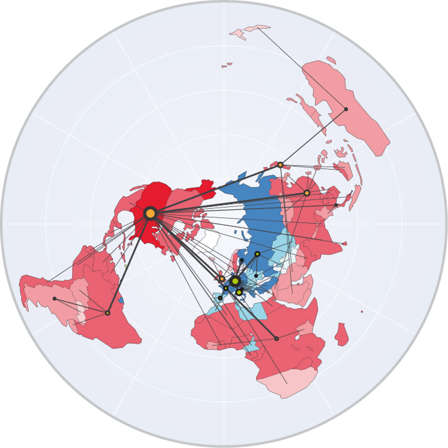 {widh=700}
:::


::: {.column width="30%" .r-fit-text}
Les USA qui sont le principal importateur en 2006 domine la plus grande partie du Monde, à l'exception de la zone Europe Méditerranée qui est dominée par l'Allemagne.

:::

::::

## Domination des exportations en 2016-2020 

```{r, eval=F}

### Mise à jour ###


### Flux totaux 2020
tab<-grav %>% filter(t5=="2016-20", is.na(Fijt)==F) %>%
           mutate(i=substr(i,1,3),j=substr(j,1,3))%>%
          group_by(i,j) %>%
         summarise(Fij=sum(Fijt))
tab<-as.data.frame(tab)
mat<-Col_Mat(tab)
mat<-t(mat)
col<-Mat_Col(mat)
col2<-Col_Sel(col,0.01,0.01) %>% filter(i !="_rest_", j != "_rest_")
dom2<-Col_Dom(col2)
net<-Viz_Dom(dom2, mytitle = "Pouvoir des exportateurs 2016-20", mysub="Source : Gravity database - CEPII")
net


```


## Domination des importations en 2006


:::: {.columns}

::: {.column width="70%" .r-fit-text}
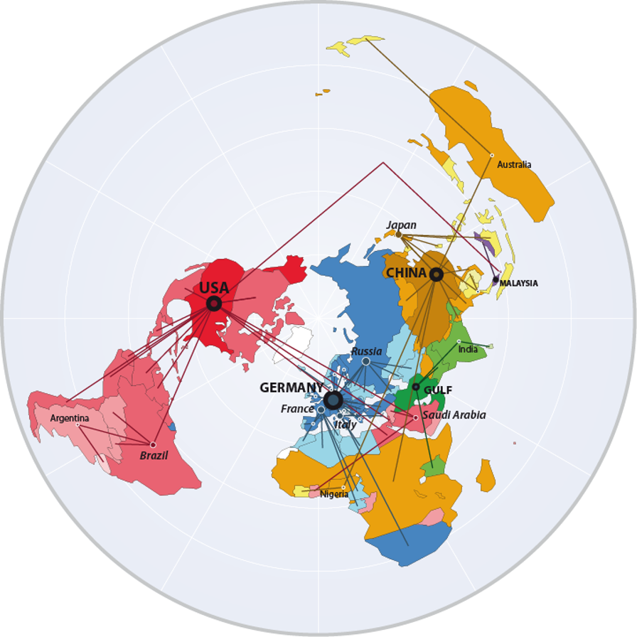 {widh=700}
:::


::: {.column width="30%" .r-fit-text}
En 2006, trois grands pays exportateurs dominent les importations des autres pays du Monde : USA, Chine et Allemagne.

:::

::::

## Domination des importations en 2016-2020 

```{r, eval+F}

### Mise à jour ###


### Flux totaux 2020
tab<-grav %>% filter(t5=="2016-20", is.na(Fijt)==F) %>%
           mutate(i=substr(i,1,3),j=substr(j,1,3))%>%
          group_by(i,j) %>%
         summarise(Fij=sum(Fijt))
tab<-as.data.frame(tab)
mat<-Col_Mat(tab)
mat<-mat
col<-Mat_Col(mat)
col2<-Col_Sel(col,0.01,0.01) %>% filter(i !="_rest_", j != "_rest_")
dom2<-Col_Dom(col2)
net<-Viz_Dom(dom2, mytitle = "Pouvoir des importateurs 2016-20", mysub="Source : Gravity database - CEPII")
net


```

## Variante II : Domination sectorielle

La domination commerciale d'un pays porte rarement sur l'ensemble des produits.  Il peut donc se créer un équilibre limitant les possibilités d'embargo ou de boycott. Deux exemples : 

- **la domination des importations d'énergie** par les **pays exportateurs** qui peuvent refuser de vendre leur production de pétrole, gaz ou  charbon.

- **la domination des importations agricoles** par les **pays exportateurs** qui peuvent refuser de vendre du blé, du maïs, du riz ...


## Domination des ventes de produits énergétiques (2016-2020) 

```{r}

x<-readRDS("data2/MYCHELEM.RDS")
### Flux totaux 2020
tab<-x %>% filter(k=="(1) ENE", t>2015,t<2021) %>%
          group_by(i,j) %>%
         summarise(Fij=sum(Fijkt))
tab<-as.data.frame(tab)
mat<-Col_Mat(tab)
mat<-t(mat)
col<-Mat_Col(mat)
col2<-Col_Sel(col,0.01,0.01) %>% filter(i !="_rest_", j != "_rest_")
dom2<-Col_Dom(col2)
net<-Viz_Dom(dom2, mytitle = "Flux dominants d'importation de produits énergétiques", mysub="Source : CHELEM-CEPII")
net


```


## Domination des ventes de produits agricoles (2016-2020)

```{r}


### Flux totaux 2020
tab<-x %>% filter(k=="(3) AGR", t>2015,t<2021) %>%
          group_by(i,j) %>%
         summarise(Fij=sum(Fijkt))
tab<-as.data.frame(tab)
mat<-Col_Mat(tab)
mat<-t(mat)
col<-Mat_Col(mat)
col2<-Col_Sel(col,0.01,0.01) %>% filter(i !="_rest_", j != "_rest_")
dom2<-Col_Dom(col2)
net<-Viz_Dom(dom2, mytitle = "Flux dominants d'importation de produits agricoles", mysub="Source : CHELEM-CEPII")
net


```

## Variante III : Alliances commerciales

Nous avons supposé jusqu'ici que chaque pays était un acteur isolé développant une stratégie autonome. Mais il existe plusieurs cas de coordination des stratégies commerciales :

- **Cartels** destinés à coordonner les prix de certains produits. Un bon exemple est l'OPEP pour le pétrole.
- **Unions douanières** destinées à réduire le coût des échanges internes à une zone tout en se protégeant des concurrents externes. L'exemple typique est l'Union Européenne. 

## Flux dominants bilatéraux 2016-2020 (UE27)

```{r}
tab<-x %>% filter(k=="TOT", t>2015,t<2021) %>%
          group_by(i,j) %>%
         summarise(Fij=sum(Fijkt))
sel<-c("FRA","DEU","ITA","NLD","BLX","IRL", "DNK",
       "AUT","NOR","SWE","ESP","PRT","GRC","POL","HUN","CZE","SVK",
       "BGR","ROU","LTU","EST","CYP","MLT","LVA","HRV")

tab$i[tab$i %in% sel]<-"UE"
tab$j[tab$j %in% sel]<-"UE"
tab<-tab %>% group_by(i,j) %>% summarise(Fij=sum(Fij)) 
tab$Fij[tab$i==tab$j]<-0
tab<-as.data.frame(tab)
mat<-Col_Mat(tab)
mat<-t(mat)+mat
col<-Mat_Col(mat)
col2<-Col_Sel(col,0.01,0.01) %>% filter(i !="_rest_", j != "_rest_")
dom2<-Col_Dom(col2)
net<-Viz_Dom(dom2, mytitle = "Flux bilatéraux (UE27 sans le Royaume-Uni)", mysub="Source : CHELEM-CEPII")
net
```

## Do it yourself : export de mon pays

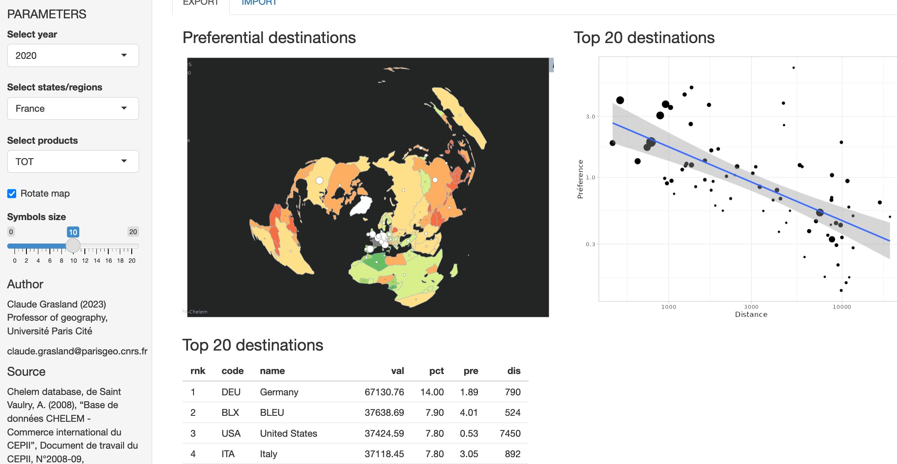{width=900}

[Explorateur Chelem](https://analytics.huma-num.fr/Claude.Grasland/chelem/)

## Do it yourself : import de mon pays

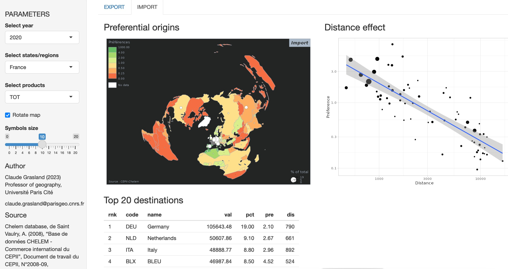{width=900}

[Explorateur Chelem](https://analytics.huma-num.fr/Claude.Grasland/chelem/)

# Evolution de la division internationale du travail

## Lectures recommandées 

- **Amin, S. (1971).** *L'accumulation à l'échelle mondiale: critique de la théorie du sous-développement*. Paris: Anthropos.

- **Reynaud, A. (1981)** *Société, espace et justice*, Paris, PUF, coll. Espace et Liberté.

- **Wallerstein, I. M. (2004)**. *World-systems analysis: An introduction*. Duke University Press.

- **Grasland, C., & Van Hamme, G. (2010).** La relocalisation des activités industrielles: une approche centre-périphérie des dynamiques mondiale et européenne. *L’espace géographique*, 39(1), 1-19.

## Le modèle Centre-Périphérie

- L'économie mondiale est organisée en Centre (C), Semi-periphérie (SP) et Periphérie (P) depuis le  XVIe Siècle (*Braudel, 1979 ; Wallerstein, 1985*)

- Le Centre est incarné par une ville capitale qui se déplace (Amsterdam-> London-> New-York-> …)

 - Les inégalités entre pays sont stables car fondées sur des mécanismes de division internationale du travail et d'échange inégal (*Amin, 1970*) repérables dans l'asymétrie des flux  (*Reynaud, 1980*)
 
 
## Le modèle Centre-Périphérie

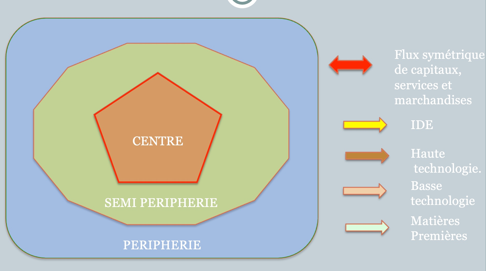{width=800}

## Le modèle Centre-Périphérie

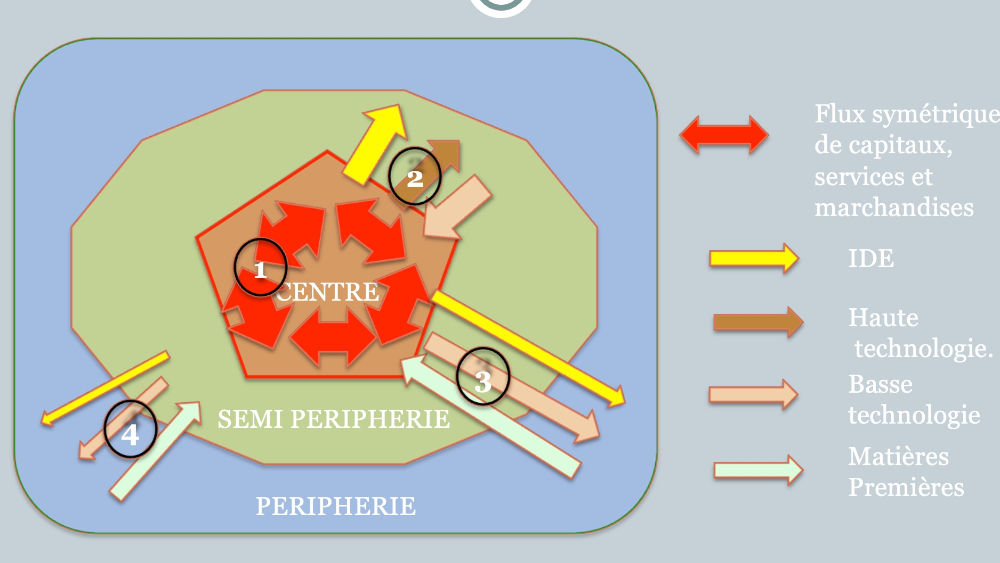{width=800}

## Le modèle Centre-Périphérie

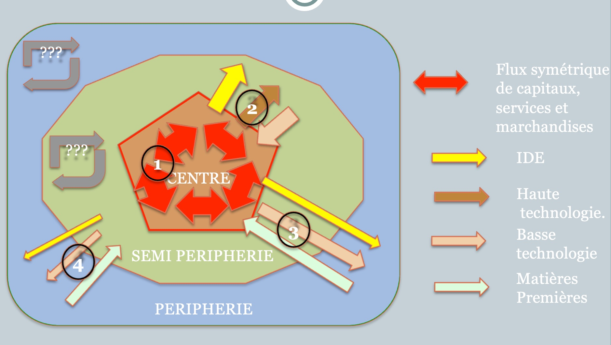{width=800}


## Situation en 2006

- **Les produits énergétiques **: constituent un secteur stratégique inégalement réparti entre pays.

- **Les matières premières et produits agricoles** : constituent en général une première étape de développement. Mais ils ont aussi un rôle stratégique pour l'alimentation (e.g. blé, riz) ou l'industrie (e.g. terres rares)

- **Les produits manufacturiers de basse, moyenne ou haute technologie** :  ont des localisations très différentes selon le rapport capital/ travail/ technologie qui intervient dans leurs chaînes de production.


## Exportations par produits en 2006

:::: {.columns}

::: {.column width="40%" .r-fit-text}
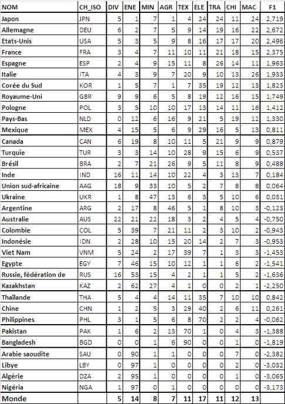{width=420}
:::


::: {.column width="60%"}
Quelle est la nature des exportations de chaque pays ?

Comment les pays se positionnent-ils dans la division internationale du travail ?

=> Synthèse des pays par Analyse en Composantes Principales (ACP)

:::

::::


## Exportations par produits en 2006

:::: {.columns}

::: {.column width="40%" .r-fit-text}
{width=420}
:::


::: {.column width="60%"}
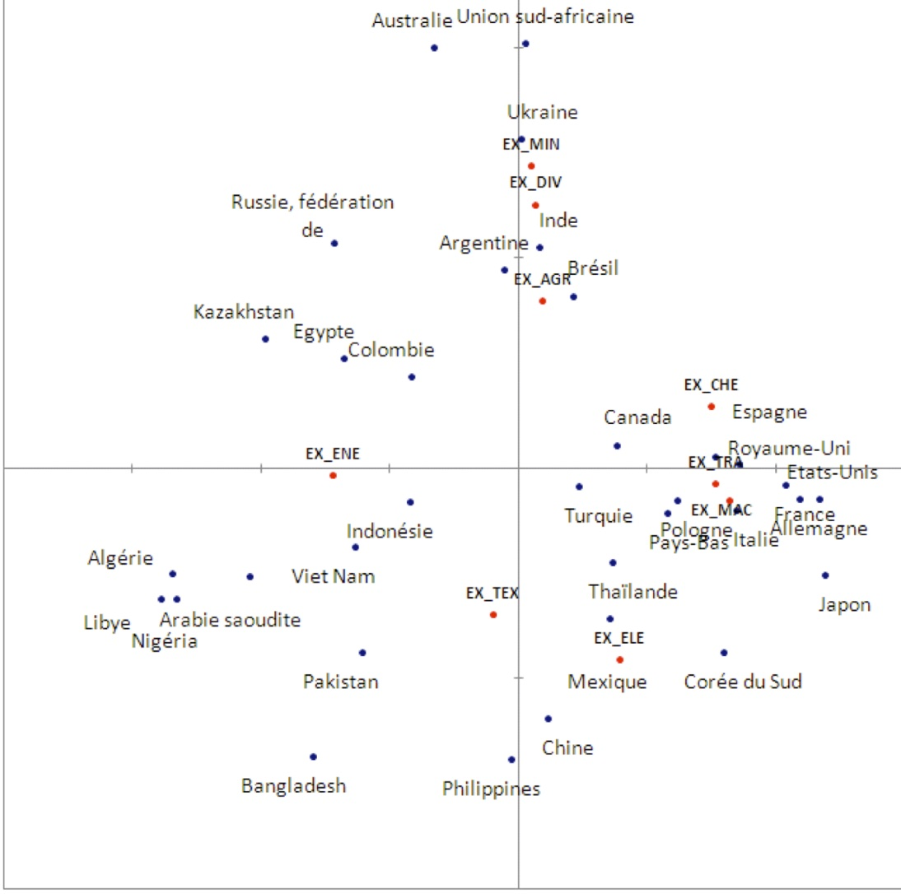{width=550}
:::

::::


## Exportations par produits en 2006

:::: {.columns}

::: {.column width="40%" .r-fit-text}
{width=420}
:::


::: {.column width="60%"}
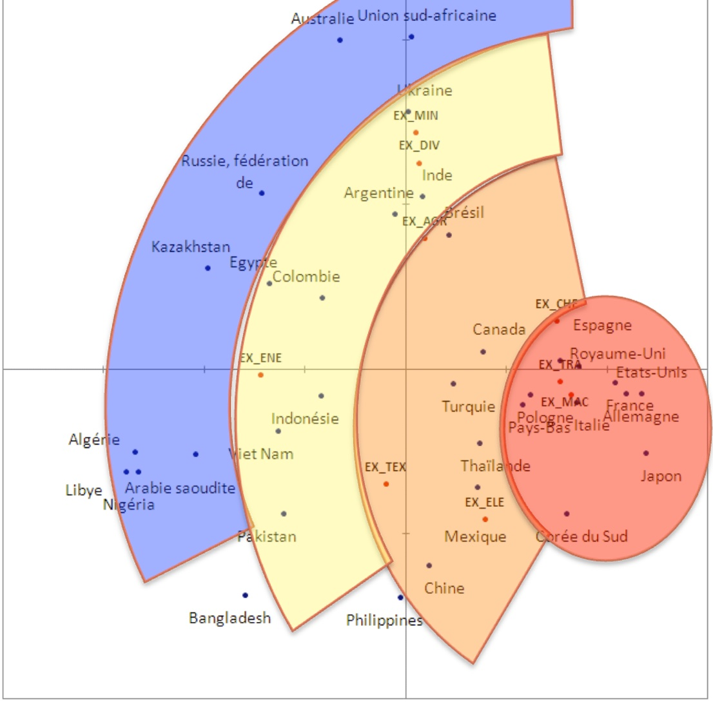{width=550}
:::

::::

## Typologie des pays 1967-2006


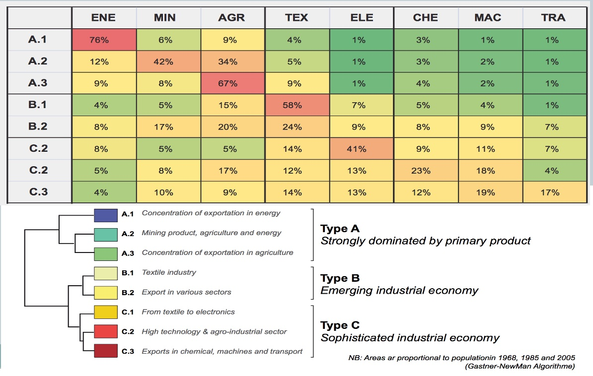{width=900}

Source : Grasland, 2014

## Le temps des décolonisations


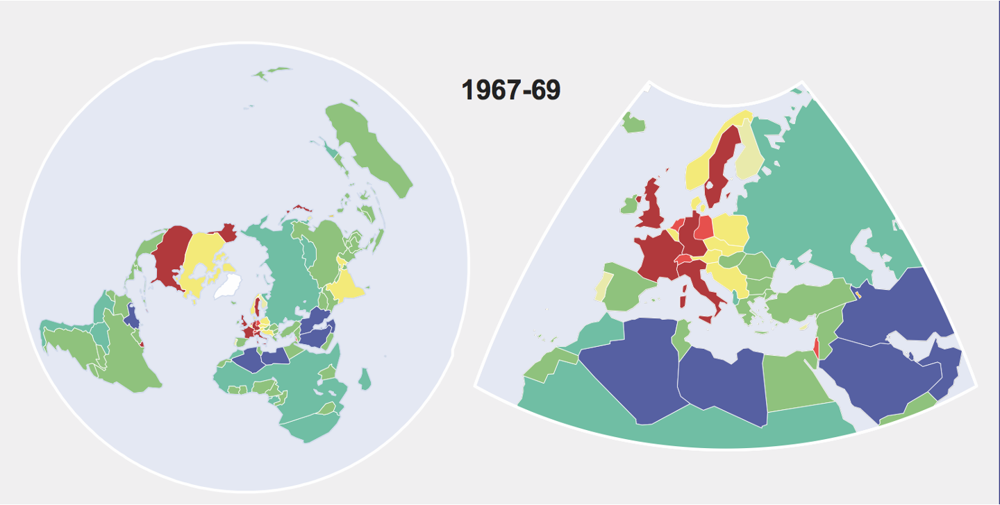{width=1100}

Source : Grasland, 2014

## La fin de la Guerre Froide


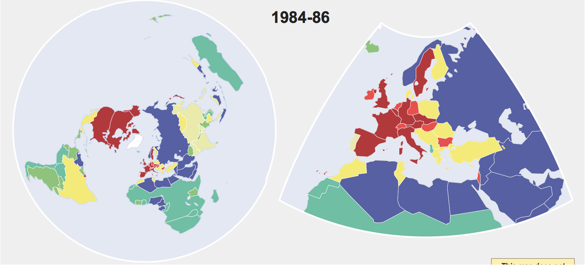{width=1100}

Source : Grasland, 2014

## Avant la crise des subprimes


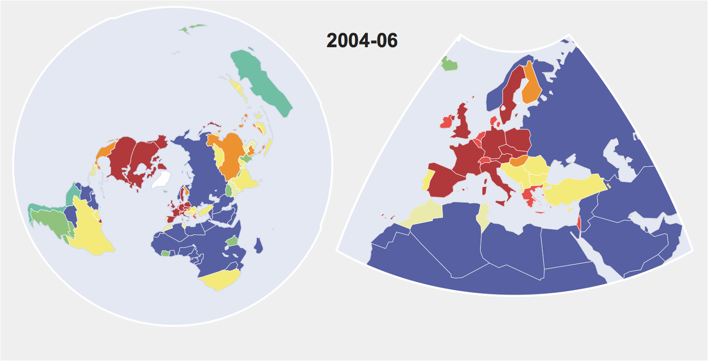{width=1100}

Source : Grasland, 2014

## Synthèse de l'évolution 1967-2006

:::: {.columns}

::: {.column width="70%" .r-fit-text}
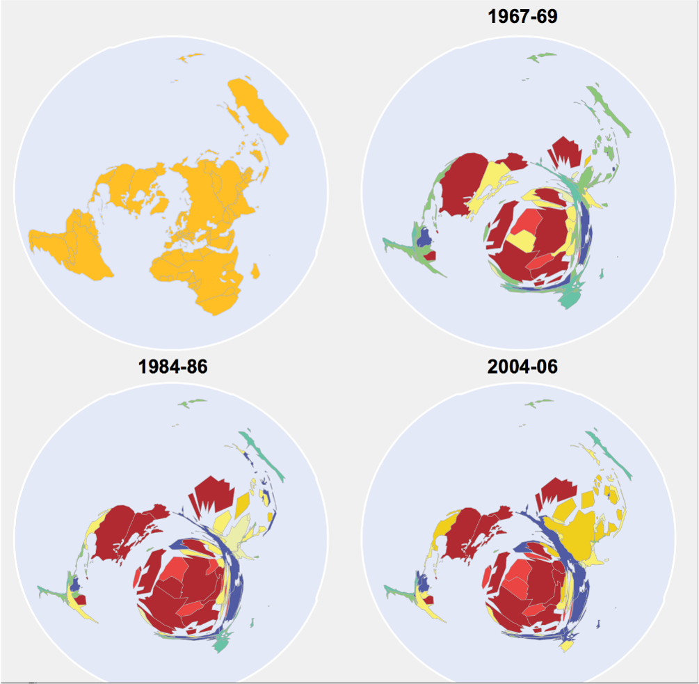{width=600}
:::


::: {.column width="30%" .r-fit-text}
- **Montée en puissance des pays émergents** en particulier la Chine, l'Inde, le Mexique.
- **Diffusion des productions manufacturières** autour des anciens centres
- **Malédiction de la rente énergétique** dans des pays situés pour la plupart autour de l'Union Européenne (Russie, Algérie  ...)
- **Dépréciation des produits agricoles** et marginalisation des pays africains dans le commerce mondial

:::

::::


# Conclusion : fragilité des chaînes de valuer

## Exemple de la crise du Covid


::: {.column width="100%" .r-fit-text}
### Coronavirus : les usines chinoises à l’arrêt, l’industrie européenne s’inquiète

Apple, Fiat Chrysler, Adidas… Le ban et l’arrière-ban de l’économie mondiale sont aujourd’hui touchés par la paralysie de la Chine, où l’épidémie due au coronavirus a déjà fait 722 morts et contaminé plus de 34 500 personnes depuis fin décembre 2019.

Avec l’hyperspécialisation des chaînes de valeur, il devient de plus en plus diffi-cile de remplacer un fournisseur par un autre », explique Ludovic Subran, chef économiste du groupe d’assurance allemand Allianz.

Au fil des ans, la Chine est devenue l’un des centres névralgiques de l’économie internationale, se muant en atelier du monde. « La part de l’Europe dans les chaînes de valeur mondiales s’est amenuisée au profit de la Chine, ajoute Alicia Garcia-Herrero, chef économiste pour la région Asie-Pacifique chez Natixis. Le pays concurrence même l’Allemagne dans la vente de produits intermédiaires sur le Vieux Continent. 

C’est un nouveau coup dur pour le Vieux Continent, déjà pénalisé par l’accord commercial signé entre Pékin et Washington en janvier. La Chine s’est engagée à acheter lors de ces deux prochaines années pour 200 mil-liards de dollars (182,4 milliards d’euros) de produits américains supplémentaires, notamment agricoles et manufacturiers, au risque de diminuer ses importations en provenance d’Europe.

 
:::


## Exemple de la guerre russo-urkrainienne

::: {.column width="100%" .r-fit-text}
### L’accord céréalier au cœur d’une nouvelle épreuve de force entre Poutine et Zelensky

C’est le 17 juillet qu’expire, à nouveau, l’accord sur les céréales ukrainiennes. Nouvelle occasion d’un bras de fer (diplomatique) dans le bras de fer (militaire), dont les conséquences pour l’Afrique risquent d’être très lourdes.
 

Sans l’application de l’accord sur les exportations de céréales ukrainiennes, le gap sur le marché mondial devrait conduire à une nouvelle envolée des prix des denrées, ce qui accentuerait la crise alimentaire de pays africains qui, pourtant, n’auraient effectivement pas été destinataires des cargaisons. Le 14 juillet, en exhor-tant la Russie à reconduire l’accord, le secrétaire d’État américain Antony Blinken anticipait, dans le cas con-traire, une « aggravation de la pénurie alimentaire ».


:::

