```{r setup, include=FALSE}

knitr::opts_chunk$set(echo = FALSE, warning= FALSE, message = FALSE, error=FALSE)
library(knitr)
library(dplyr)
library(RColorBrewer)
library(data.table)
library(FactoMineR)
library(explor)
library(plotly)
library(flextable)
library(gt)
library(ggplot2)
library(ggrepel)
library(kableExtra)


```


# INTRODUCTION 


## Régions infranationales et supranationales

### Région infranationale

Le terme *région* est souvent employé pour décrire  le premier niveau d'organisation du territorie en dessous de celui de **l'état**.  Quels que soient les critères employés (*Cf. ci-après*), le découpage régional d'un pays est une affaire de **pouvoir** (politique, économique, intellectuel, symbolique, ...) qui se règle dans un cadre national. 

### Région supranationale / infra mondiale 

Mais le terme *region* est aussi employé pour décrire des regroupements de pays (*ex. Union Européenne*) ou des entités géographiques situés immédiatement en dessous du niveau mondial (*ex. Europe*). Contrairement a cas précédent, **il n'existe pas ici de pouvoir unique** à même d'arbitrer entre les différents découpages possibles du Monde. 


## Géographie ou Sciences Régionale ?

### L'expertise des géographes

Les géographes se présentent souvent comme des experts de la régionalisation et sont effectivement souvent consultés sur les questions de régionalisation aux échelles infra-nationales et supra-nationales.

### La science régionale

Mais d'autres disciplines peuvent revendiquer à juste titre une expertise au moins équivalente sur ces questions de découpage. Notamment les juristes, les économistes, les sociologues, les psychologues. 


#  CONCEPTS ET THEORIES : LE DECOUPAGE REGIONAL DE LA FRANCE 

## Les "régions morphologiques" de Philippe Buache


:::: {.columns}

::: {.column width="20%" .r-fit-text}
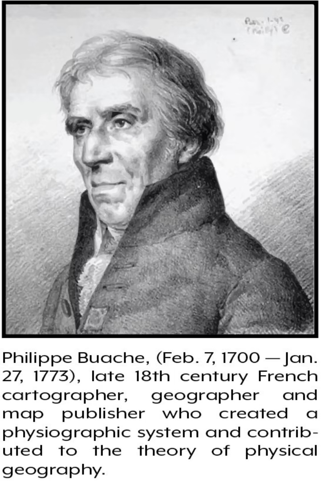{width=200}

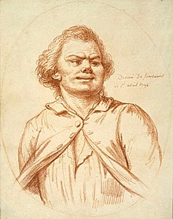{width=200}
Georges Danton, 1759-1794

:::


::: {.column width="80%" .r-fit-text}

«Les limites de la France sont marquées par la nature, nous les atteindrons des quatre coins de l'horizon, du côté du Rhin, du côté de l'Océan, du côté des Pyrénées, du côté des Alpes. Là doivent finir les bornes de notre République » (*Danton, 31 Janvier 1793*)

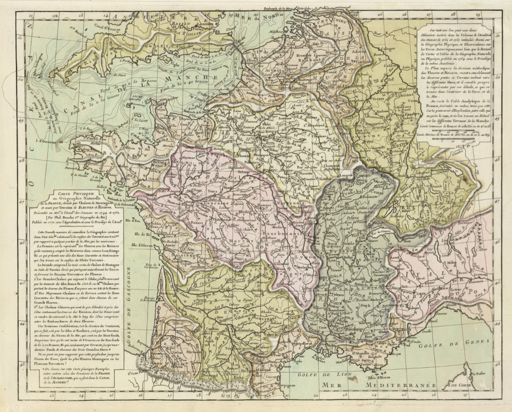{width=450}
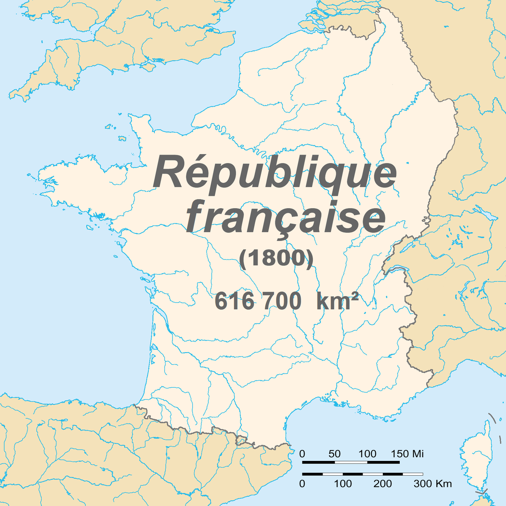{width=300}
:::

::::


## Les "régions naturelles" de Vidal de la Blache


:::: {.columns}

::: {.column width="20%" .r-fit-text}
{width=150}
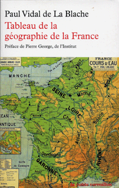{width=150}
:::


::: {.column width="80%" .r-fit-text}

On présente souvent le fondateur de la géographie française, Paul Vidal de la Blache, comme l'inventeur du découpage de la France en **régions naturelles** fondées sur la géologie ou les bassins hydrographiques...

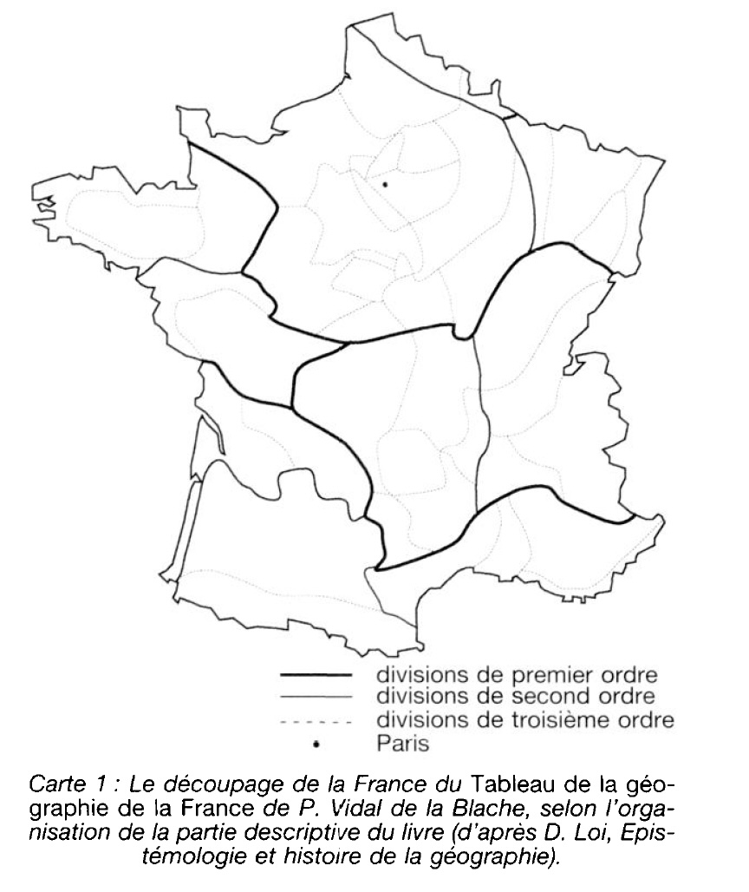{width=450}
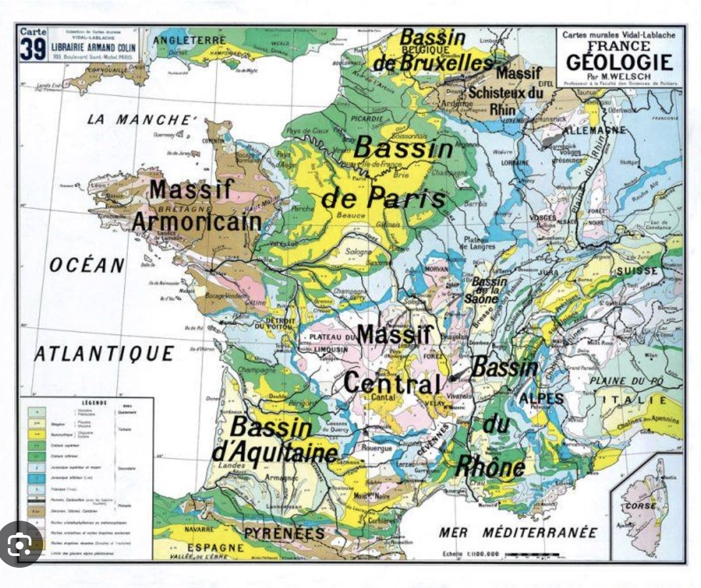{width=450}

:::

::::


## Proposition de réforme régionale de Vidal de la Blache


:::: {.columns}

::: {.column width="20%" .r-fit-text}
{width=150}
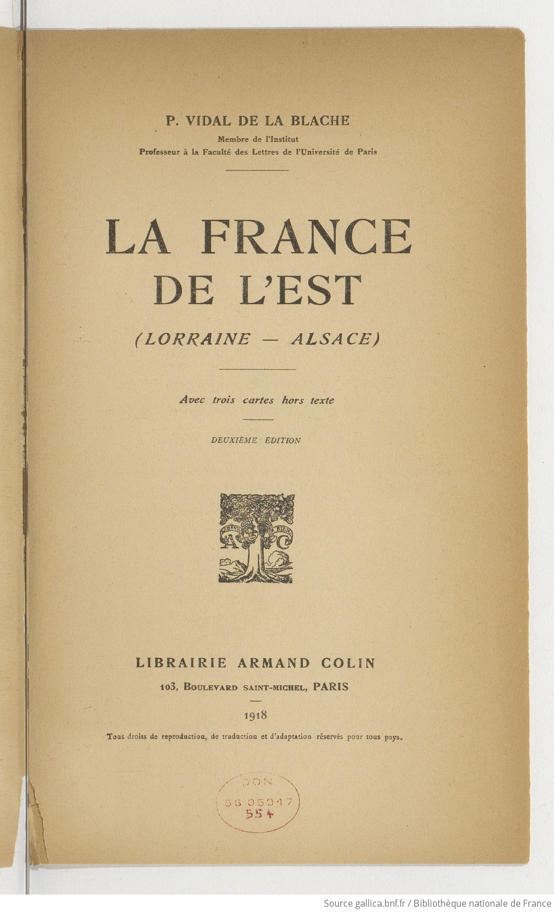{width=150}
:::


::: {.column width="80%" .r-fit-text}

Mais Vidal de la Blache a proposé de nombreux autres critères de régionalisation fondées sur l'économie, les transports ou la polarisation des villes. Il proposa même une **réforme régionale** qui anticipe avec un siécle d'avance les lois de décentralisation.

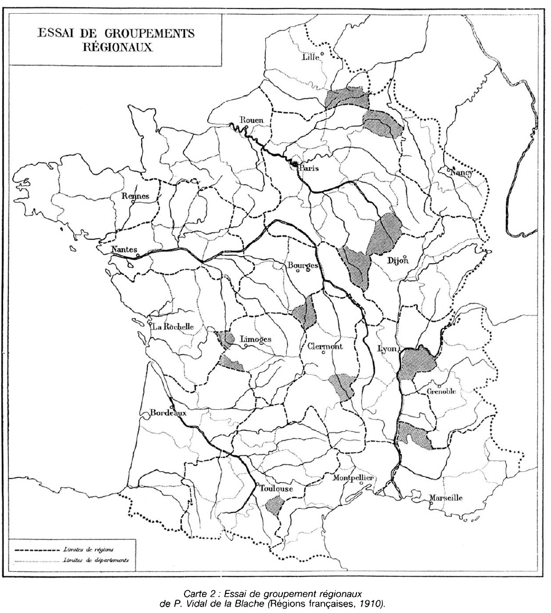{width=450}
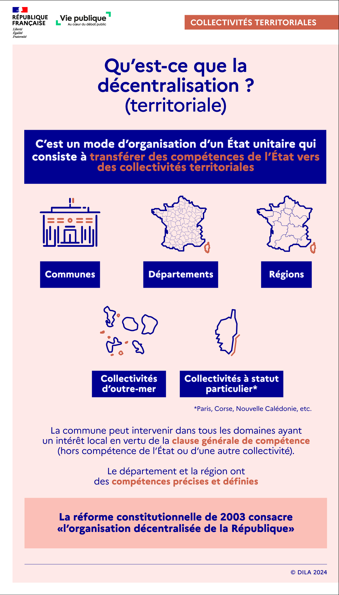{width=250}

:::

::::


## La synthèse d'Etienne Juillard : (1) régions homogènes


:::: {.columns}

::: {.column width="20%" .r-fit-text}
{width=150}

- **Juillard Étienne**, "La région: essai de définition", *Annales de géographie*, Vol. 71, No. 387. Armand Colin, 1962.
:::


::: {.column width="80%" .r-fit-text}

La **région homogène** semble encore assimilée au concept de **paysage**. Mais celui-ci incorpore l’élément humain (activité agricole, activité industrielle, villes, …). La région homogène se définit par sa **forme aréale** et ses **limites précises**.


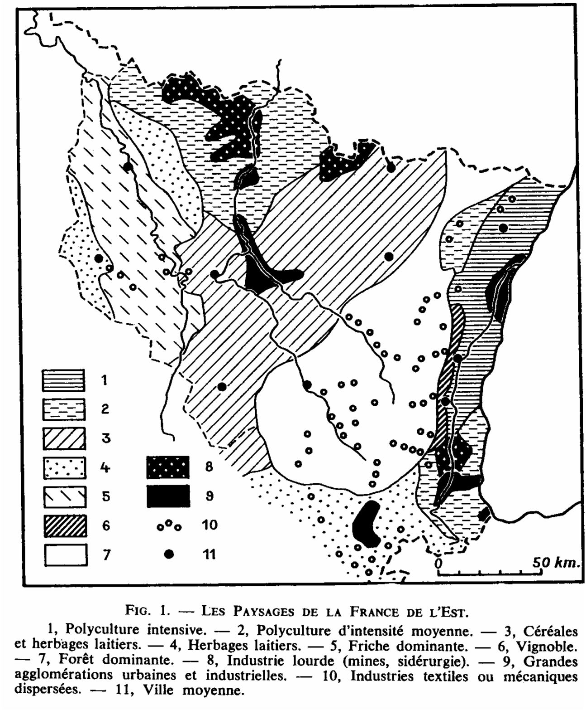{width=450}


:::

::::

## La synthèse d'Etienne Juillard : (2) régions polarisées


:::: {.columns}

::: {.column width="20%" .r-fit-text}
{width=150}

- **Juillard Étienne**, "La région: essai de définition", *Annales de géographie*, Vol. 71, No. 387. Armand Colin, 1962.
:::


::: {.column width="80%" .r-fit-text}

La **région polarisée (ou fonctionnelle)** est basée sur les **flux et les réseaux**. Elle s'organise autour d'une **hiérarchie de pôles**. Les aires d'influence des centres sont **floues** et **variables** au cours du temps. 


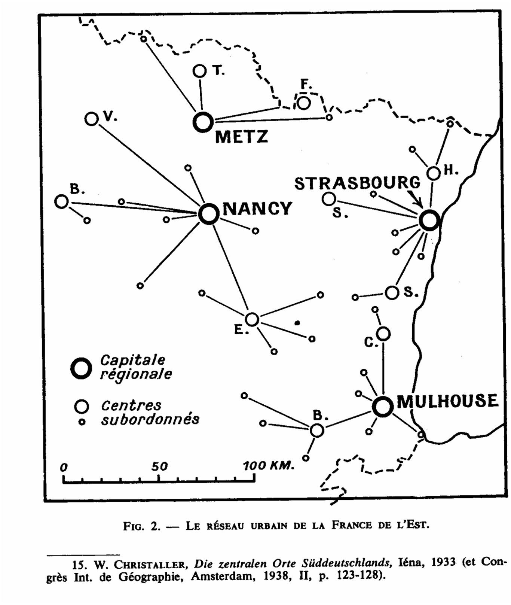{width=450}


:::

::::


## La synthèse d'Etienne Juillard : (3) régions politiques


:::: {.columns}

::: {.column width="20%" .r-fit-text}
{width=150}

- **Juillard Étienne**, "La région: essai de définition", *Annales de géographie*, Vol. 71, No. 387. Armand Colin, 1962.
:::


::: {.column width="80%" .r-fit-text}

Les **régions politiques ou administratives** sont des découpages mis en place par un **pouvoir** afin de contrôler, gérer, coordonner ou légitimer ses actions. La région est **le premier niveau d'organisation en dessous de l'état**. 


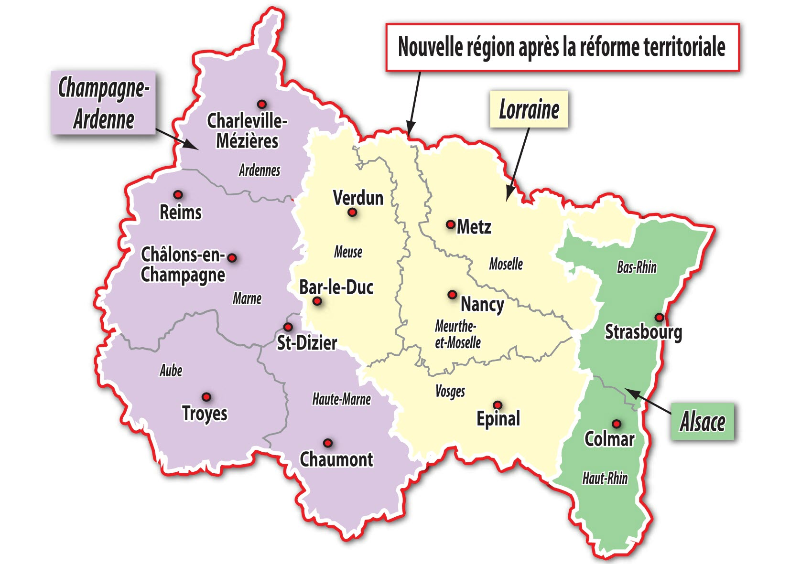{width=650}


:::

::::


## Le codicille d'A. Frémont: (4) la région "espace vécu"


:::: {.columns}

::: {.column width="20%" .r-fit-text}
{width=150}

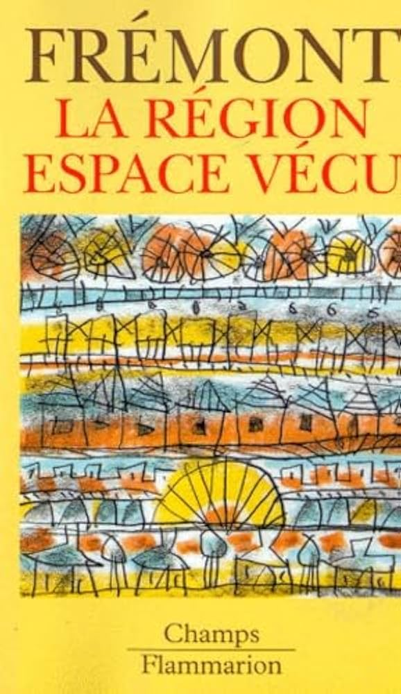{width=150}
- **Frémont A. (1974)**, "Recherches sur l'espace vécu", *L'espace géographique*, 231-238.
:::


::: {.column width="80%" .r-fit-text}

*L’homme n’est pas un objet neutre à l’intérieur de la région […] Il perçoit inégalement l’espace qui l’entoure, il porte des jugements sur les lieux, il est retenu ou attiré, consciemment ou inconsciemment, il se trompe et le trompe… ». L’espace est donc considéré comme « vécu » dans le sens où il est « vu, perçu, ressenti, aimé ou rejeté, modelé par les hommes et qu’il projette sur eux des images qui les modèlent.* (Frémont A., 1976) 


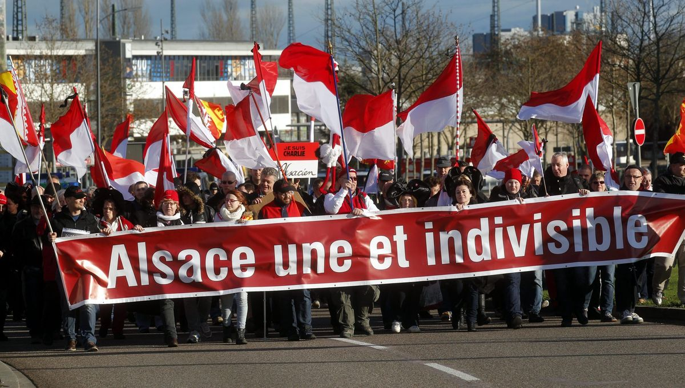{width=650}


:::

::::


# 1. REGIONS MORPHOLOGIQUES : LA FAUSSE NEUTRALITE DES CONTINENTS


## A quelle "région du Monde" appartenez-vous ?


:::: {.columns}

::: {.column width="30%"}
#### Etudiants de géographie (2025)
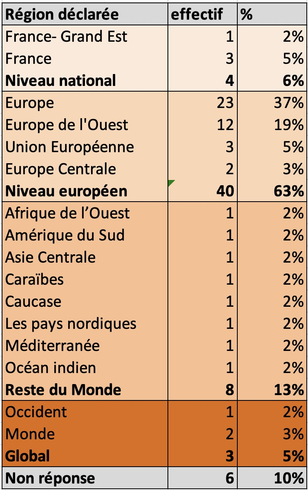{width=300}

Source : Enquête SMA 2025, U. Paris Cité
:::


::: {.column width="70%"}
#### Etudiants France métropolitaine (2021)
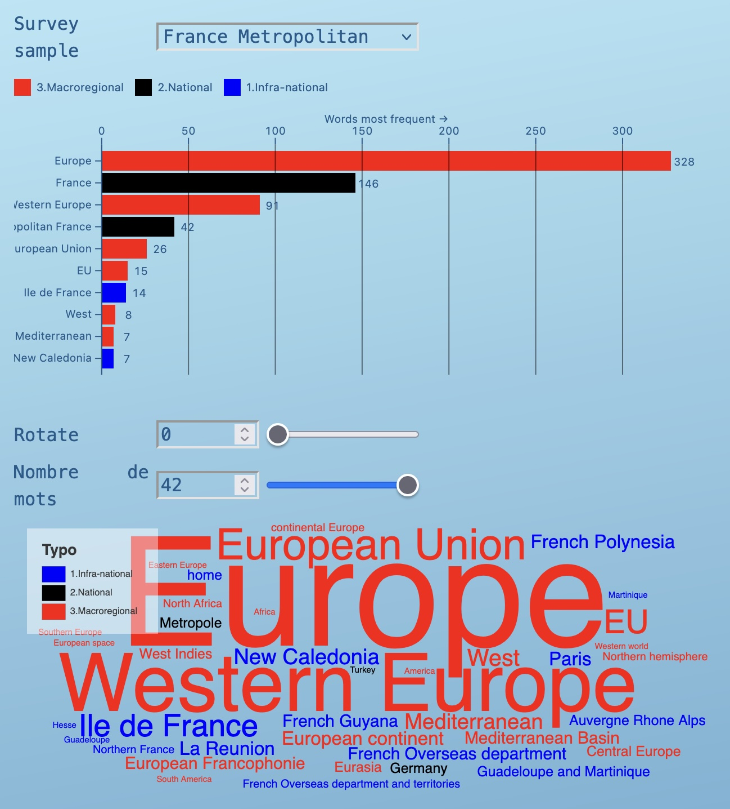{width=500}

[Source : Enquête IMAGEUN, 2020-2021](https://elinamx.github.io/atlas-imageun/docs/france.html)
:::
::::


## Un découpage ternaire inventé au Moyen-Âge par les Européens ...


:::: {.columns}

::: {.column width="30%"}
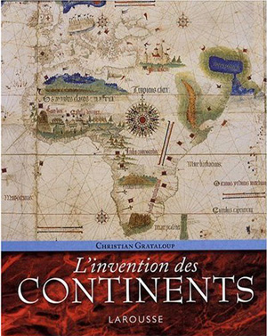{width=300}
:::


::: {.column width="70%"}
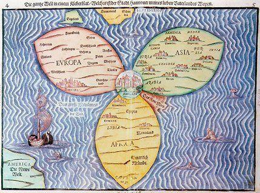{width=600}
:::
::::

Source : **Grataloup, Christian, 2009,**  *L'invention des continents: comment l'Europe a découpé le monde*. Larousse, Paris.


## ... à partir de textes religieux ...


:::: {.columns}

::: {.column width="50%" .r-fit-text .smaller}
 L’humanité, selon la Genèse, descend des trois fils de Noé : Sem, Japhet et Cham. Le texte biblique ne nous indique pas les directions dans lesquelles ils partent, mais des listes de lieux. On pouvait en déduire que Sem était parti vers l’Est, Japhet vers le Nord- Ouest et Cham vers le Sud-Ouest. On en a déduit longtemps que l’humanité était divisée en trois « races », auxquelles devaient correspondre trois territoires : **L’Asie pour les descendants de Sem, l’Afrique pour ceux de Cham et l’Europe pour ceux de Japhet**.
:::


::: {.column width="50%"}
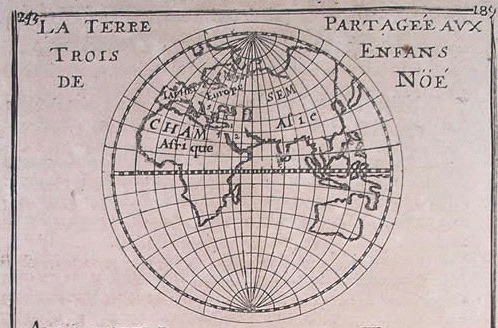{width=600}
:::
::::


## ... utilisés plus tard pour justifier la traite négrière.


:::: {.columns}

::: {.column width="50%" .r-fit-text .smaller}
D'après la Bible, après le Déluge, Noé réinvente l'agriculture et replante, entre autres, la vigne. Il s'enivre et, dans le lourd sommeil qui suit son ivresse, il se dénude de façon impudique. Son benjamin, Cham, le voit, s’en amuse et avertit ses frères aînés. Ces derniers, refusant de voir ainsi leur père, s’approchent à reculons pour le couvrir de son manteau. A son réveil, Noé le blâme et maudit le fils de Cham, Canaan ; **il est condamné ainsi que sa descendance à être les « serviteurs des serviteurs » des descendants de Sem et Japhet**. 
:::


::: {.column width="50%"}
{width=600}
:::
::::
Source : Grataloup C.

## Un découpage binaire lié aux grandes découvertes ...

:::: {.columns}

::: {.column width="40%"}
#### Planisphère de Waldseemüller (1503)
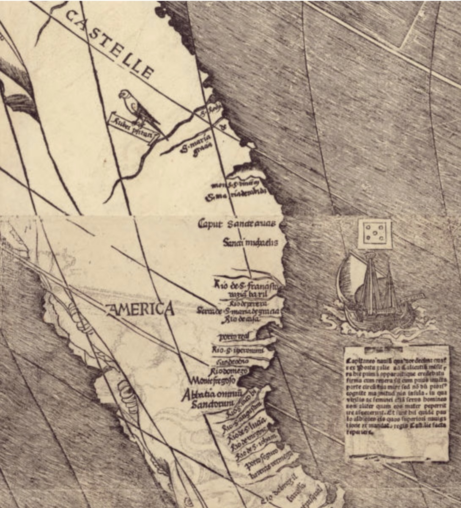{width=400}
:::


::: {.column width="60%"}

#### Carte de Mallet (1683)

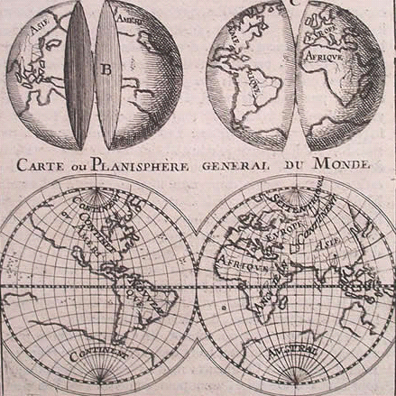{width=600}
:::
::::


## ... qui oppose Ancien et Nouveau Monde ....


#### Carte de Malte-Brun (1836)

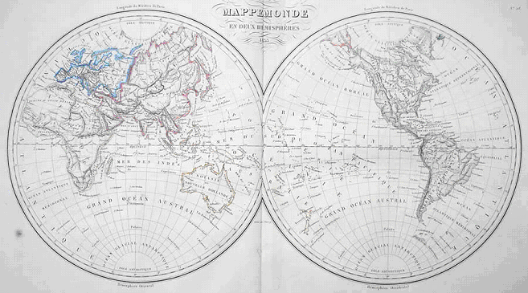{width=700}


## ... et fait passer le nombre de continents à quatre, cinq, six ...


#### Manuel de Géographie de Demangeon (1955)

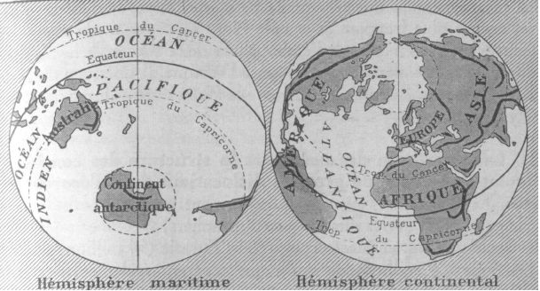{width=700}


## ... ou sept,  non sans incertitudes !

#### Page Wikipedia consacrée aux continents

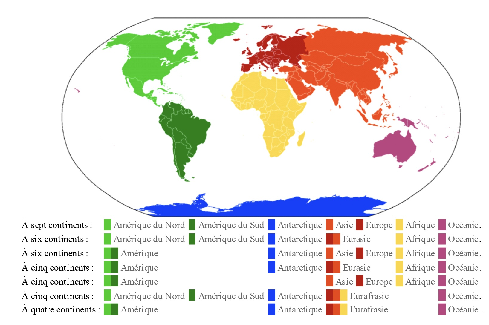{width=900}

## Mais qu'est-ce au juste qu'un continent ?


:::: {.columns}


::: {.column width="30%" .r-fit-text .smaller}
#### Dictionnaire Le Robert

1. Grande étendue de terre limitée par un ou plusieurs océans.

2. Partie du monde. Les six continents : l'Europe, l'Asie, l'Afrique, l'Amérique, l'Océanie et l'Antarctique. 

3. La terre par rapport à une île.
:::


::: {.column width="70%"}
#### L'exemple du jeu Civilization


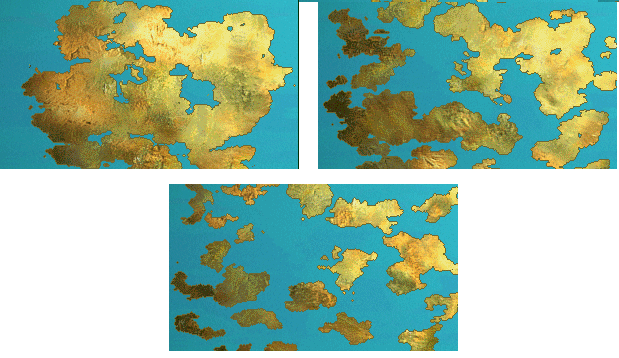{width=600}

Options de jeu : "*Pangée*", "*Continents*"   \\
                       ou "*Archipel*"
:::
::::

## Une définition formelle ?


:::: {.columns}

::: {.column width="30%"}
{width=150}
{width=300}

:::


::: {.column width="70%" .r-fit-text .smaller}

- **6.341** Représentons nous une surface blanche couverte de taches noires et irrégulières. Et nous dirons : Quelle que soit l’image qui en résulte, je puis toujours en donner la description approximative qu’il me plaira, en couvrant la surface d’un filet fin adéquat à mailles carrées et dire de chaque carré qu’il est blanc ou noir. De cette manière, j’aurais donné **une forme unifiée à la description de la surface.**

**Cette forme est arbitraire**, car j’aurais pu tout aussi bien me servir d’un filet à mailles triangulaires ou hexagonales et obtenir un résultat non moins satisfaisant. 

**A ces différents filets correspondent différents systèmes de la description de l’univers**. 


:::
::::


## Une définition formelle ?


:::: {.columns}

::: {.column width="30%"}
{width=150}

{width=300}

:::


::: {.column width="70%"}

#### 21 continents ?
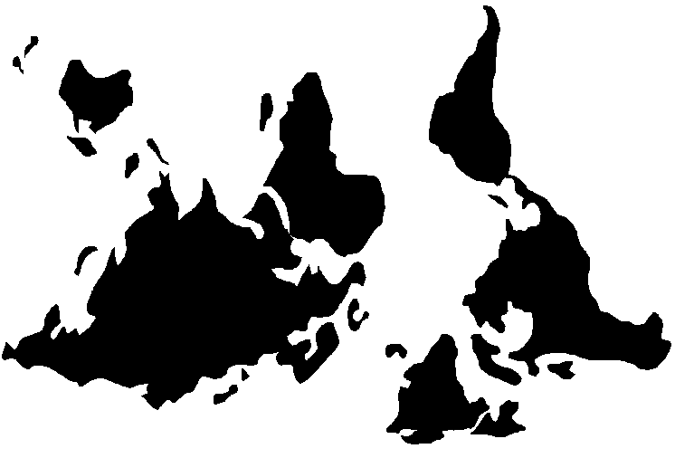{width=700}


:::
::::


## Une définition formelle ?


:::: {.columns}

::: {.column width="30%"}
{width=150}

{width=300}

:::


::: {.column width="70%"}

#### 14 continents ?
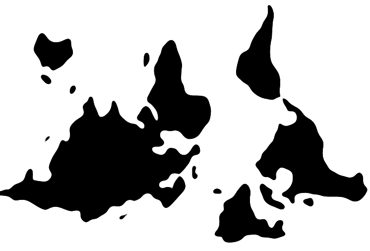{width=700}


:::
::::

## Une définition formelle ?


:::: {.columns}

::: {.column width="30%"}
{width=150}

{width=300}

:::


::: {.column width="70%"}

#### 6 continents 
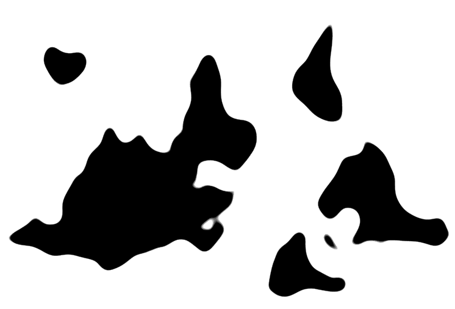{width=700}


:::
::::

## Une définition formelle ?


:::: {.columns}

::: {.column width="30%"}
{width=150}

{width=300}

:::


::: {.column width="70%"}

#### 2 continents ?
{width=700}


:::
::::


## Une définition mathématique


:::: {.columns}

::: {.column width="50%"}
#### Terres émergées
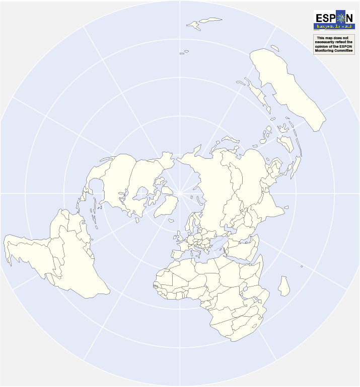{width=450}
:::


::: {.column width="50%"}
#### Potentiel de surface 
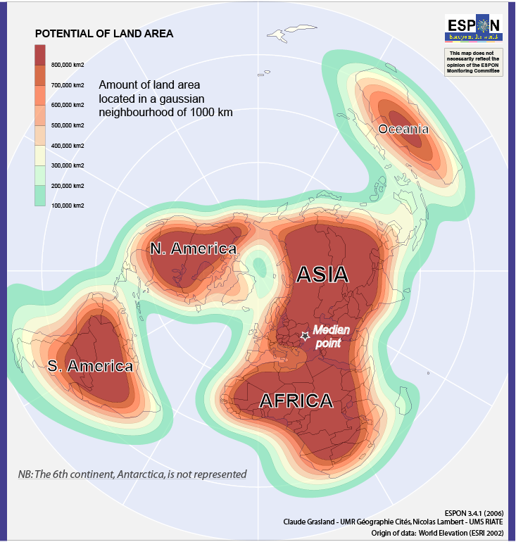{width=450}
:::
::::
Source : **Didelon C., Richard Y. Grasland C., 2008,** Atlas de l'Europe dans le Monde, Paris, Documentation Française


## Une définition mathématique


:::: {.columns}

::: {.column width="50%"}
#### Population totale
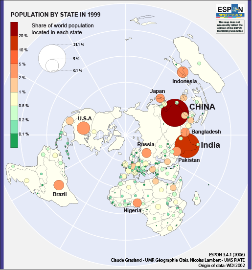{width=450}
:::


::: {.column width="50%"}
#### Potentiel de population 
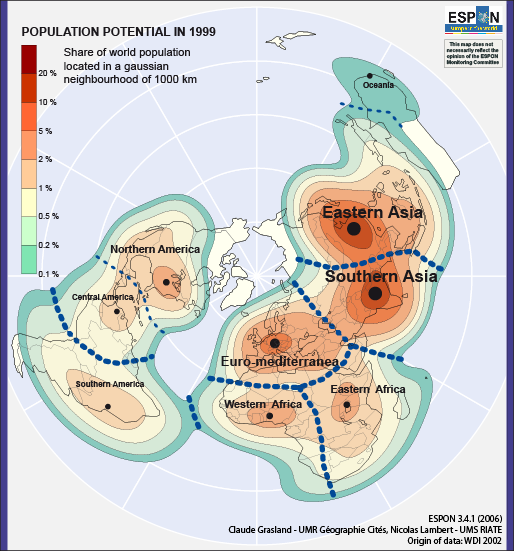{width=450}
:::
::::
Source : **Didelon C., Richard Y. Grasland C., 2008,** Atlas de l'Europe dans le Monde, Paris, Documentation Française


## Une définition mathématique


:::: {.columns}

::: {.column width="50%"}
#### PIB en volume
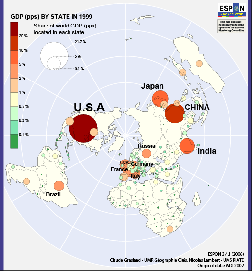{width=450}
:::


::: {.column width="50%"}
#### Potentiel de richesse
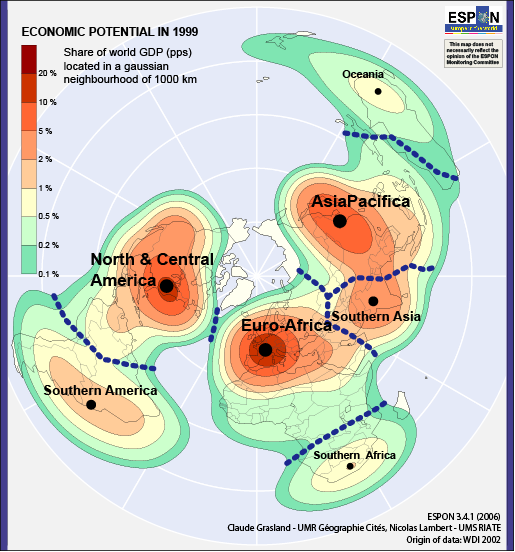{width=450}
:::
::::
Source : **Didelon C., Richard Y. Grasland C., 2008,** Atlas de l'Europe dans le Monde, Paris, Documentation Française


## Des limites faussement évidentes ...

:::: {.columns}

::: {.column width="50%" .r-fit-text .smaller}
“La plupart des manuels présentent l’Europe comme un « continent », c’est-à-dire un objet fini et évident, composé d’éléments divers (relief, climat, démographie, traditions populaires, activités économiques) dont le point commun primordial est d’être localisé à l’intérieur des frontières conventionnelles de ce continent. Cette approche tautologique, qui consiste à délimiter un ensemble géographique puis à caractériser son identité en fonction des éléments qu’il contient, laisse transparaître la persistance du vieux cadre épistémologique de la géographie régionale”. Source : [Brennetot & Rosenberg (2013)](https://journals-openedition-org.ezproxy.u-paris.fr/espacepolitique/2613?lang=en)
:::


::: {.column width="50%"}
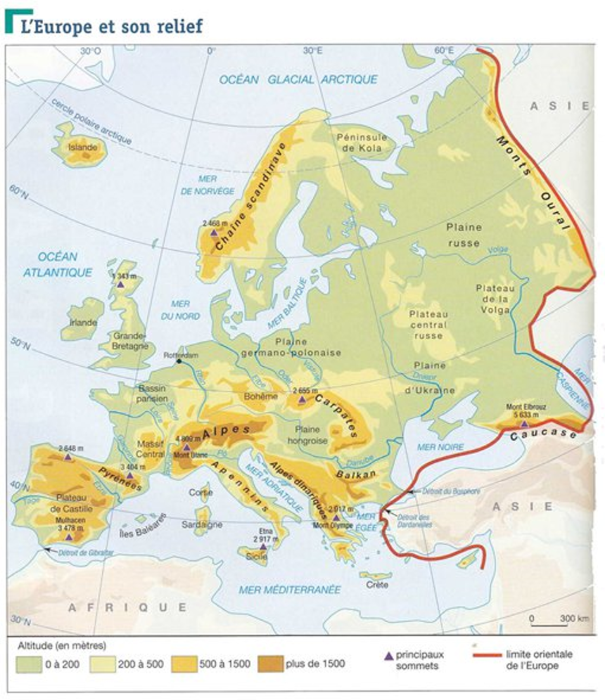{width=450}
:::
::::


## ... qui sont objet de débats politique...


:::: {.columns}

::: {.column width="40%" .r-fit-text .smaller}


- "la Turquie *n’est pas un pays européen* Pourquoi ? Parce que sa capitale n’est pas en Europe, parce que “95% de sa population vit en dehors de l’Europe. […] Le lendemain de l’ouverture des négociations avec la Turquie, vous aurez une demande marocaine d’adhésion à l’UE, le Roi du Maroc le dit depuis longtemps […]. Si nous devons laisser le continent ouvert au sud-est, pourquoi ne pas le laisser ouvert au sud-ouest ?"

Source : **Valery Giscard d'Estaing**, Président de la convention sur l'avenir de l'Union Européenne, 2002


:::


::: {.column width="60%"}
#### Caricature de Plantu, Le Monde, 2002
{width=600}

:::
::::


## ... et de perceptions variables.


:::: {.columns}

::: {.column width="40%" .r-fit-text .smaller}

- "les frontières ne sont pas données par la nature, mais sont des productions culturelles. Etablies dans des contextes historiques spécifiques et pour servir des projets particuliers, ces frontières sont sujettes à des changements et doivent toujours être remises en question." 

Source : **P. Clerc**, 2002, Turquie :  la géographie-prétexte [Le Monde](https://www.lemonde.fr/europe/article/2002/11/18/turquie-la-geographie-pretexte-par-pascal-clerc_298538_3214.html)
:::


::: {.column width="60%"}

#### Limites de l'Europe tracé par des étudiants français en 2021

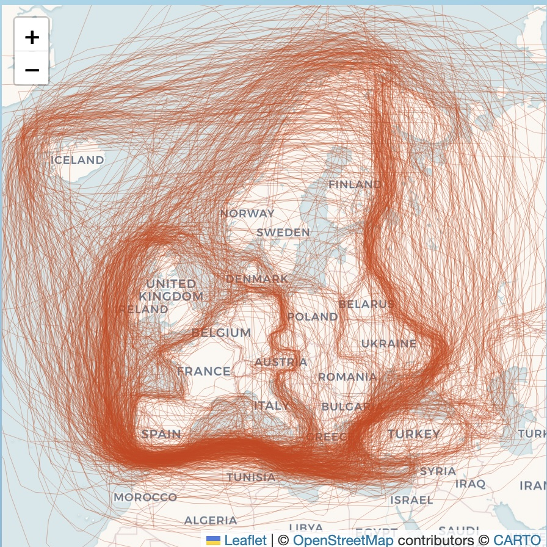{width=600}
:::
::::


## Continents "durs" et continents "mous"


:::: {.columns}

::: {.column width="30%"}
{width=200}
:::


::: {.column width="70%"}
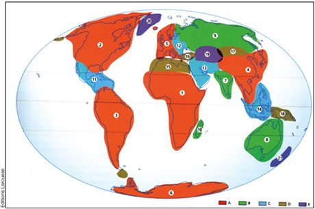{width=800}
:::
::::
Source : **Grataloup, Christian, 2009,**  *L'invention des continents: comment l'Europe a découpé le monde*. Larousse, Paris


# 2.  REGIONS HOMOGENES : ENTRE NATURE ET CULTURE


## Qu'est-ce qu'une région homogène ? 


:::: {.columns}

::: {.column width="50%" .r-fit-text .smaller}
- "La région peut se concevoir comme un découpage fondé sur la spatialisation d'un seul ensemble de caractères homogènes [...]. On parle de domaine lorsque le climat et le relief constituent l'unique critère de différenciation régionale ou de milieu quand le géographe tient également compte du milieu vivant"

**Levy J. & Lussault M., 2003,** *Dictionnaire de la géographie et de l'espace des sociétés*, Belin, Paris.
:::


::: {.column width="50%"}
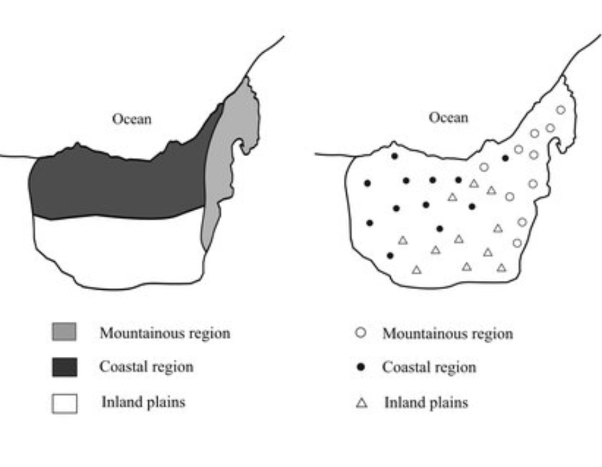{width=800}
:::
::::


## Régions "naturelles" :  les "Royaumes" biogéographiques ...


:::: {.columns}

::: {.column width="30%" .r-fit-text .smaller}
"The Kingdom, or Realm, is the highest-ranking unit in
the biogeographical system. Each of these territories
has continental dimensions and its biotas show a
certain degree of common and specific characteristics
of each one, although they usually encompass a great
diversity of climates."

Source : **Loidi, J., & Vynokurov, D. (2024).** The biogeographical kingdoms and regions of the world. *Mediterranean Botany, 45(2)*, 
:::


::: {.column width="70%"}
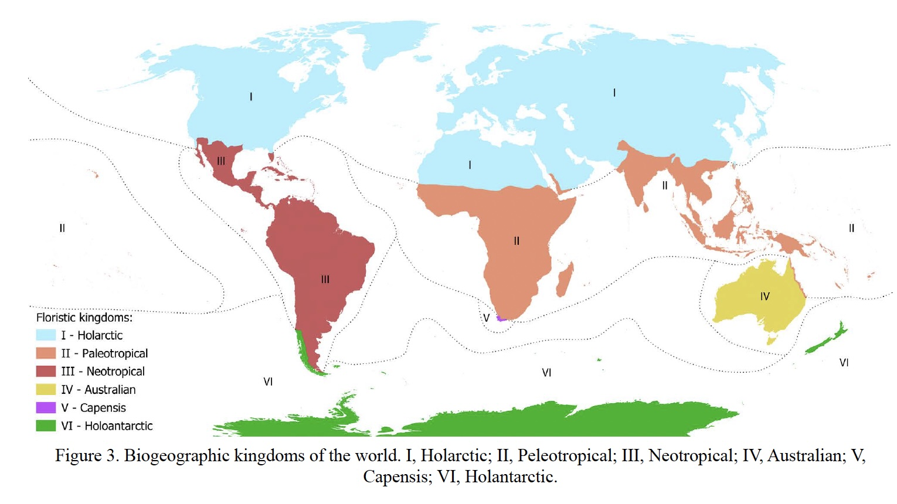{width=800}
:::
::::
## Régions "naturelles" :  les régions biogéographiques ...


:::: {.columns}

::: {.column width="30%" .r-fit-text .smaller}
"The kingdoms are further divided into regions, which
are extensive territories characterized by a high level
of floristic specificity, which can include some small
endemic families, and the level of endemism increases
as we descend to lower taxonomic ranks such as genera
and species, where it encompasses a majority of the
taxa."

Source : **Loidi, J., & Vynokurov, D. (2024).** The biogeographical kingdoms and regions of the world. *Mediterranean Botany, 45(2)*, 
:::


::: {.column width="70%"}
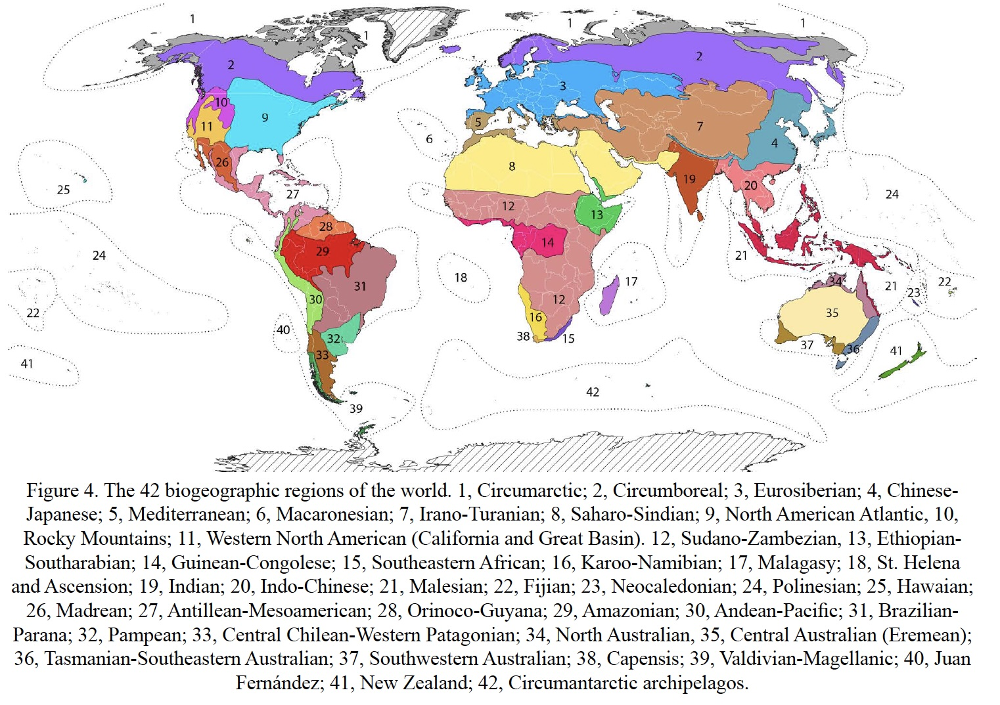{width=800}
:::
::::


## Régions "naturelles" : Les zones climatiques traditionnelles ...


:::: {.columns}

::: {.column width="30%" .r-fit-text .smaller}
#### La théorie antique des climats
«Les hommes du Nord sont forts et valeureux, car endurcis par le climat froid, mais ils sont peu intelligents et inaptes aux affaires politiques ; les hommes du Sud (Nord-Africains, Asiatiques, Éthiopiens...) ont une intelligence vive et une grande imagination, mais ils sont mous car affaiblis par le climat chaud ; enfin, les hommes des moyennes latitudes possèdent les meilleures qualités des uns et des autres».

Source : **Pinna M., 1989,** "Un aperçu historique de «la théorie des climats»," *Annales de géographie*, Vol. 98, No. 547
:::


::: {.column width="70%"}
#### Carte scolaire contemporaine (CM1-CM2)
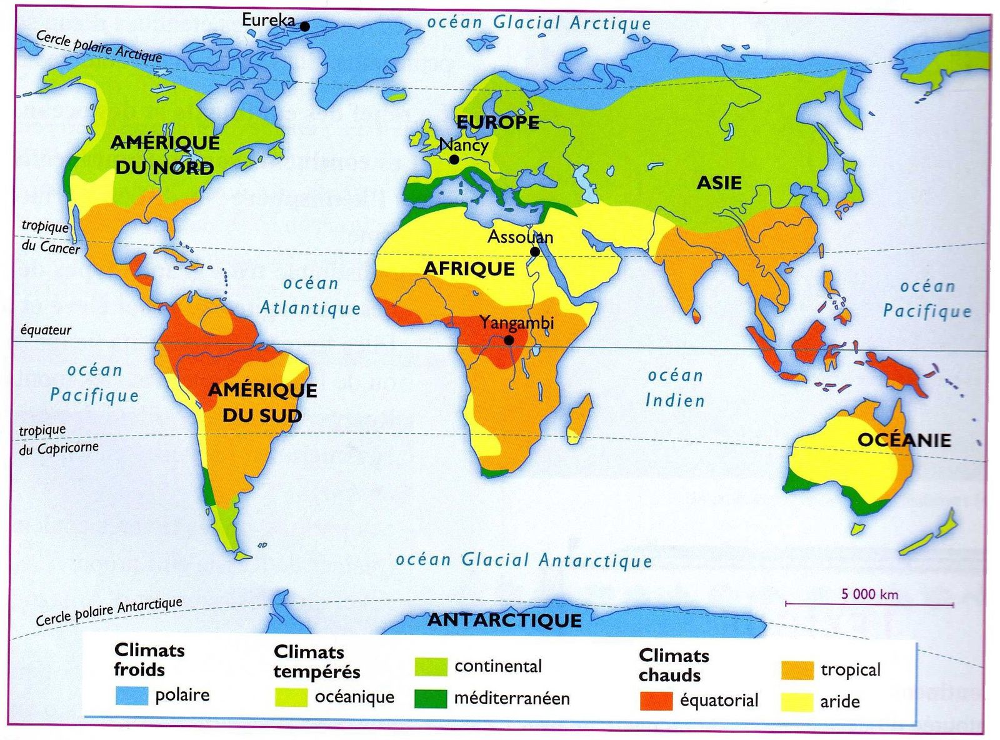{width=800}
:::
::::


## Régions "naturelles" : le découpage climatique du GIEC


:::: {.columns}

::: {.column width="30%" .r-fit-text .smaller}
"Plusieurs séries de régions de référence ont été utilisées dans la littérature pour la synthèse régionale des informations observées et modélisées sur le climat et le changement climatique. Un exemple courant est la série de régions de référence utilisée dans le rapport spécial du Groupe d'experts intergouvernemental sur l'évolution du climat (GIEC) sur la gestion des risques d'événements extrêmes et de catastrophes pour faire progresser l'adaptation au climat (SREX)".

Source : [Iturbide & al., 2020](https://essd.copernicus.org/articles/12/2959/2020/)
:::


::: {.column width="70%"}
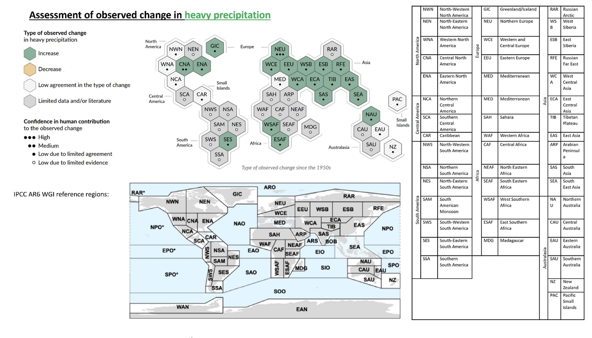{width=800}
:::
::::


## Régions "culturelles"  : les races (France, 1937)


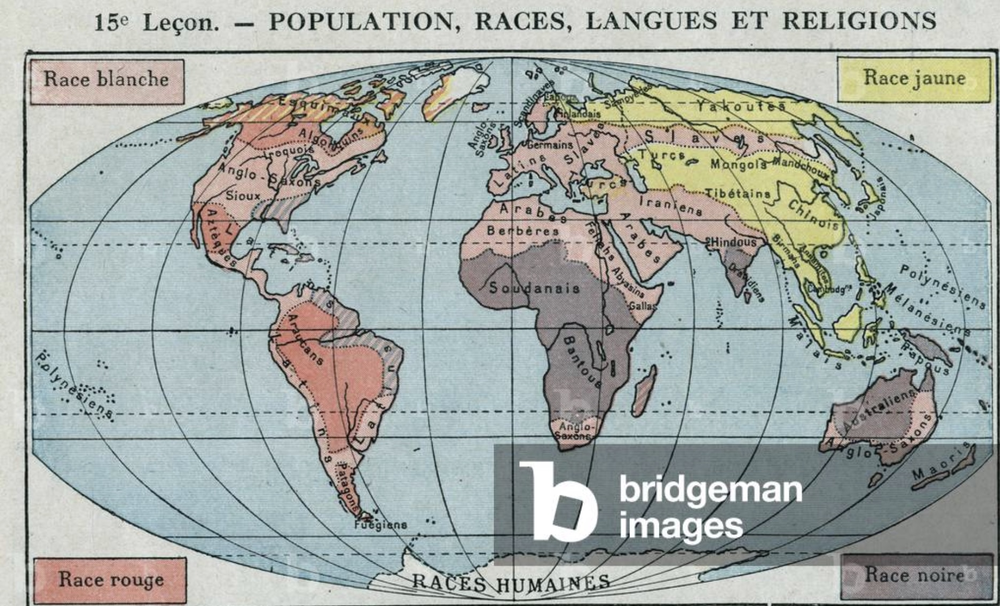{width=800}

Source ; Carte publiée en France vers 1937 dans un manuel de géographie. **Remarquer le choix des  couleurs utilisées"**

## Régions "culturelles" : les races (URSS, 1970's)


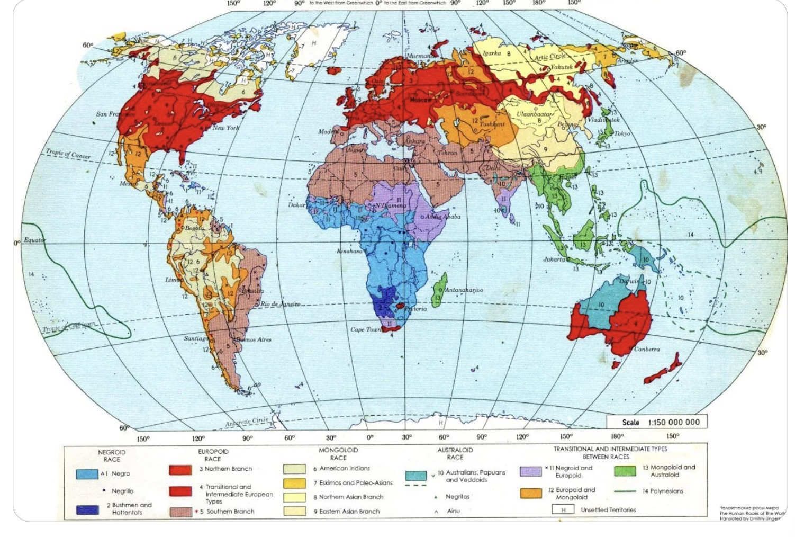{width=800}

Source ; Carte des "races humaines" produite en Union soviétique dans les années 1960-70  et traduite en anglais. **Remarquer la catégorie "transinational"**


## Régions "culturelles" : les langues officielles


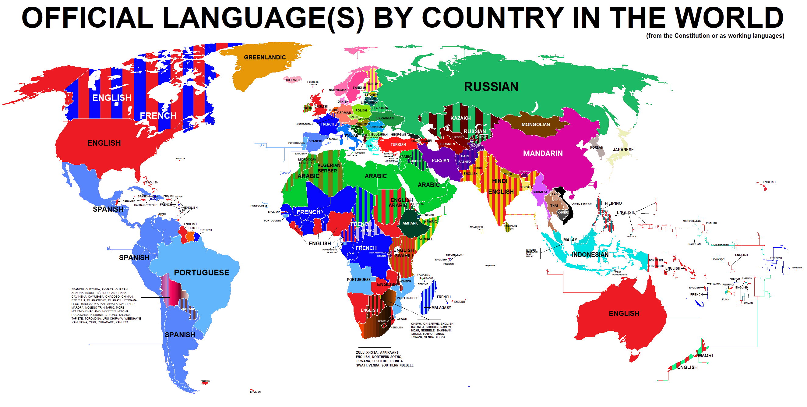{width=800}

Source : Wikipedia english, consulté le 21 mars 2024, [World Official Languages](https://en.wikipedia.org/wiki/File:World_Official_languages.png)


## Régions "culturelles" : les langues "originelles"

"*La carte des tribus et des familles de langues présente une classification des langues principalement d'un* **point de vue génétique**. *Elle représente des* **familles de langues dont les langues individuelles descendent d'une langue de base commune, souvent hypothétique**, *comme l'indo-européen ou l'hamitosémitique.Les limites des familles linguistiques présentées ne doivent être considérées que comme des valeurs approximatives.*" (Diercke Welt Atlas, 2023)

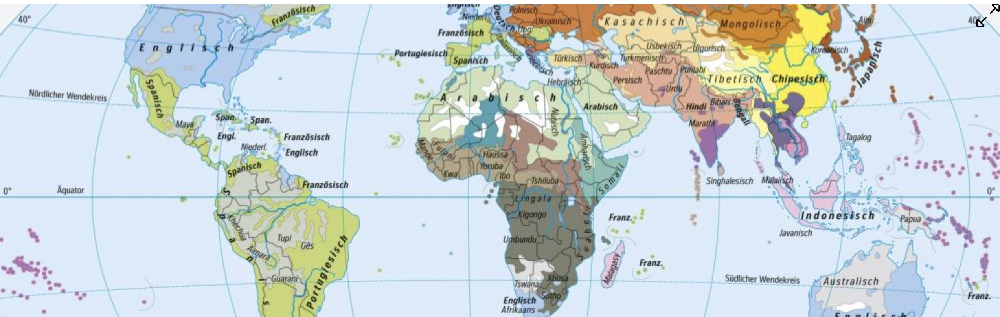{width=800}

Source : Diercke Welt Atlas, 2023, p.278, [Erde Religionen und Sprachen](https://diercke.de/content/erde-sprachen-978-3-14-100800-5-278-2-1)


## Régions "historico-religieuses" : les "civilisations" 


«*Une civilisation donnée, ce n’est donc ni une économie donnée, ni une société donnée, mais ce qui, à travers des séries d’économies, des séries de sociétés, persiste à vivre en ne se laissant qu’à peine et peu à peu infléchir*» (Braudel F., 1963)

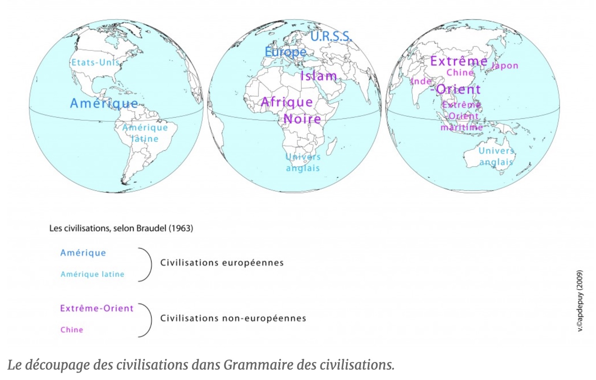{width=800}

Source : **Braudel F., 1963**, *Grammaire des civilisations*, Paris, Flammarion


## Régions "historico-religieuses" : les "civilisations" 


«*Si nous voulons réfléchir sérieusement au monde et y agir efficacement, une sorte de carte simplifiée de la réalité, une théorie, un concept, un modèle, un paradigme, est nécessaire.*» (Huntington S., 1993)

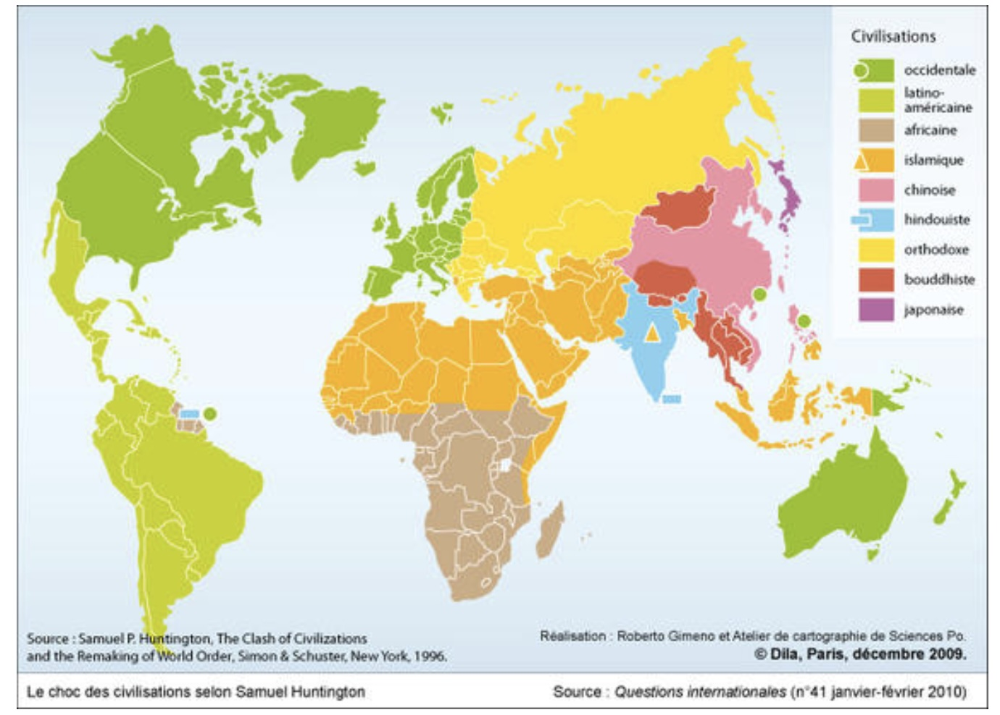{width=600}

Source : **Huntington S. P., 1996**,  *The Clash of Civilizations and the Remaking of World Order* New York:Simon & Schuster.


## xx


:::: {.columns}

::: {.column width="70%"}

:::


::: {.column width="30%"}

:::
::::


## xx


:::: {.columns}

::: {.column width="70%"}

:::


::: {.column width="30%"}

:::
::::

## xx


:::: {.columns}

::: {.column width="70%"}

:::


::: {.column width="30%"}

:::
::::


## xx


:::: {.columns}

::: {.column width="70%"}

:::


::: {.column width="30%"}

:::
::::

## xx


:::: {.columns}

::: {.column width="70%"}

:::


::: {.column width="30%"}

:::
::::


#  Introduction : Intégration régionale et régionalisme


## Deux ouvrages de référence
<div class="centered">
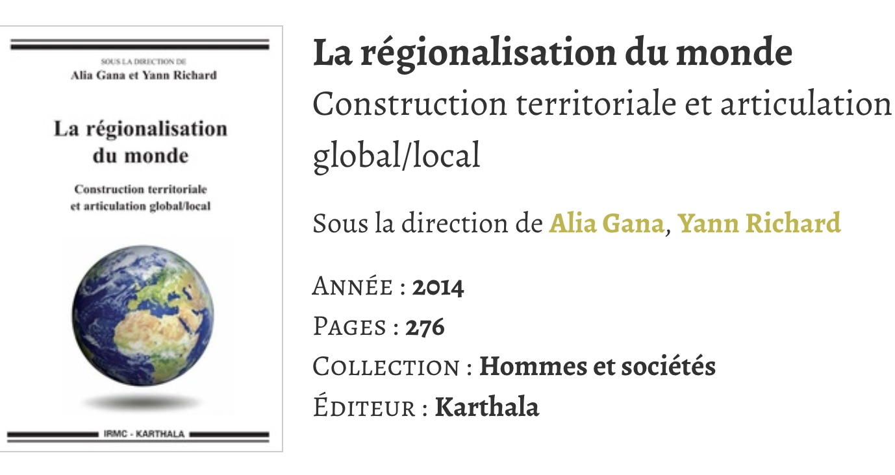
</div>

- Une synthèse des réflexions des géographes français en 2014 sur les rapports entre **régionalisation** et **mondialisation** autour des concets d'**intégration régionale** et de **régionalisme**.  Contenu du livre accessible [en ligne](https://www.cairn.info/la-regionalisation-du-monde--9782811111403.htm)

## Deux ouvrages de référence
<div class="centered">
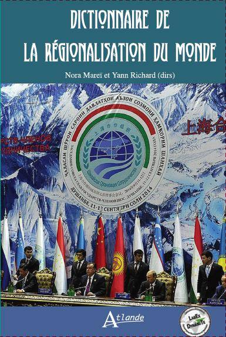
</div>

- Une mise à jour de l'ouvrage précédent effectuée en 2018 sous la forme d'un **dictionnaire des concepts** comprenant plusieurs **études de cas**. 

## Régionalisation : définition 

- La régionalisation désigne une **augmentation des échanges entre des unités territoriales situées dans la même partie du monde**. Il peut s’agir de pays, de régions ou d’autres entités infra étatiques. 

- La régionalisation aboutit à ce que **les échanges internes à ce paquet d’unités territoriales soient plus élevés ou plus intenses qu’avec le reste du monde**. 

- Dans certains cas, les échanges internes sont effectivement plus élevés que les échanges externes. Dans d’autres cas, leur part est minoritaire mais leur augmentation est plus rapide. Dans le premier cas, la régionalisation est un **fait établi**. Dans l’autre, elle est un **processus en cours**.

Source : Y. Richard, 2014, "Régionalisation, régionalisme et intégration régionale : concepts flous et nécessaire clarification", in [Richard Y. & Gana A., 2014](https://www.cairn.info/la-regionalisation-du-monde--9782811111403-page-21.htm)


## Régionalisation : exemple théorique

<div class="centered">
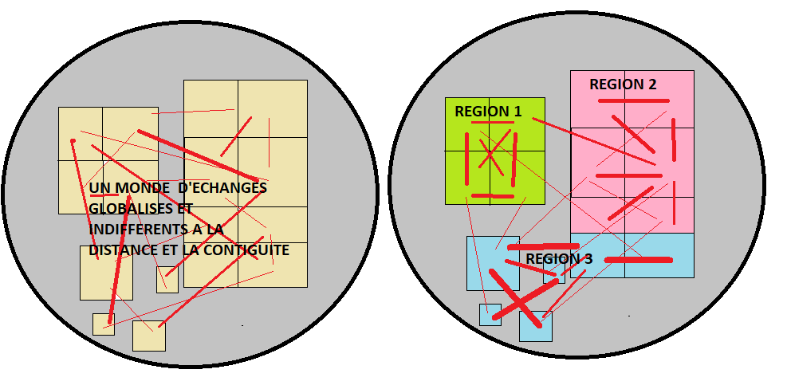
</div>

- **à gauche**, un monde **globalisé** où les relations entre pays sont indifférentes aux coûts de transports et aux frontières. ..
- **à droite**, un monde **régionalisé** où les échanges se concentrent entre les pays voisins (**régions 1 et 2**) ou des pays proches reliés par des routes marines (**région 3**)


## Régionalisation : un fait établi ?

<div class="centered">
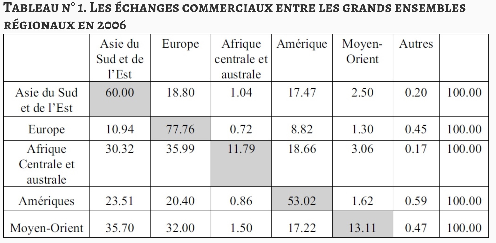
</div>

Source : G. van Hamme, 2014, "Régionalisme, intégration régionale et mondialisation : quelques éclairages sur un triangle complexe", in [Richard Y. & Gana A., 2014](https://www.cairn.info/la-regionalisation-du-monde--9782811111403-page-45.htm)


## Régionalisation et mondialisation

- Dans le contexte idéologique libéral des années 1990, l’**intégration économique régionale a été perçue par de nombreux auteurs comme une menace potentielle au développement économique** (Krugman, 1991 ; Frankel et al., 1995). Cette crainte s’appuie, d’une part, sur l’idée que la **libre circulation généralisée des biens et services** est le meilleur chemin vers la prospérité économique et, d’autre part, que le régionalisme pourrait être un frein à l’ouverture économique.

- Mais, dès la fin des années 1990, ces craintes s’estompent car  **les aires de libre-échange régional n’ont pas mené de politique protectionniste, bien au contraire** (*cf. cas de l'UE*)

- D'une part, en favorisant les processus d’agglomération économique sur des marchés plus larges, **la régionalisation permettrait en particulier aux économies les plus faibles de mieux faire face à une ouverture économique plus large**. D’autre part, d’un point de vue plus politique, **le libre-échange régional se heurte à de moindres résistances que l’ouverture commerciale tous azimuts**.


Source : G. van Hamme, 2014, "Régionalisme, intégration régionale et mondialisation : quelques éclairages sur un triangle complexe", in [Richard Y. & Gana A., 2014](https://www.cairn.info/la-regionalisation-du-monde--9782811111403-page-45.htm)

## Régionalisation et mondialisation

<div class="centered">
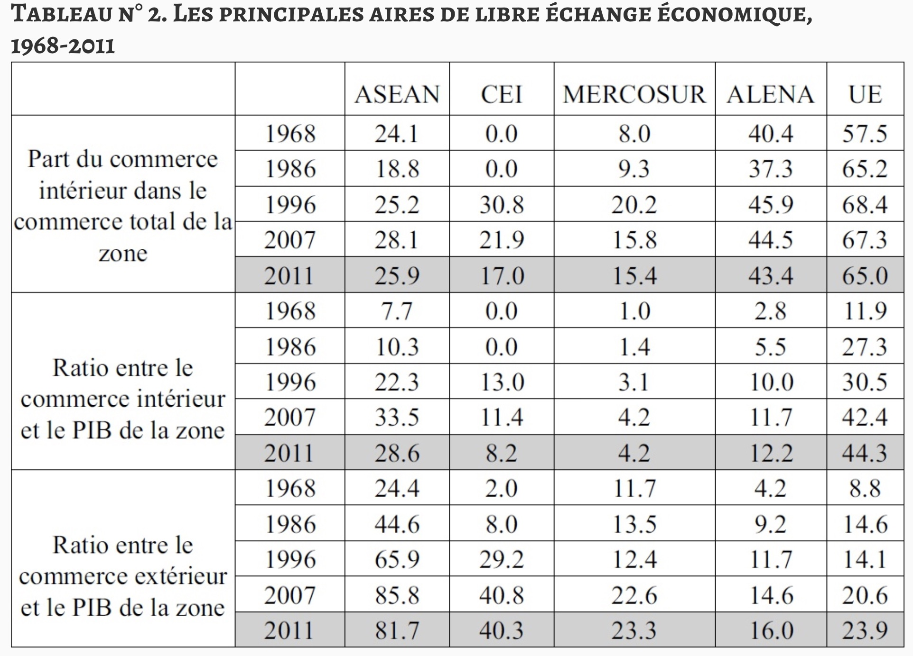
</div>

Source : G. van Hamme, 2014, "Régionalisme, intégration régionale et mondialisation : quelques éclairages sur un triangle complexe", in [Richard Y. & Gana A., 2014](https://www.cairn.info/la-regionalisation-du-monde--9782811111403-page-45.htm)


## Régionalisation : un processus multisectoriel

- La régionalisation est un processus multisectoriel qui **ne se limite pas au commerce** (échanges de marchandises, de services et d’investissements). Tous les flux ou autres modes de relations peuvent se régionaliser : **flux touristiques, migrations ou mobilités internationales, aide au développement, communications téléphoniques et électroniques…**

- C’est **une dynamique qui dessine et redessine en permanence des ensembles géographiques aux limites mouvantes**. Ces limites peuvent se confondre avec le tracé des frontières de certains États ou bien passer au milieu de leur territoire.

- Parler de régionalisation revient à mettre l’accent sur le **processus en cours** ou sur le résultat indépendamment de ses causes.

Source : Y. Richard, 2014, "Régionalisation, régionalisme et intégration régionale : concepts flous et nécessaire clarification", in [Richard Y. & Gana A., 2014](https://www.cairn.info/la-regionalisation-du-monde--9782811111403-page-21.htm)


## Régionalisme : définition

- Le régionalisme implique l’idée d’une **action consciente et planifiée**, d’une **stratégie**.  Il a pour origine un ensemble de décisions prises par des acteurs situés dans la même partie du monde à un moment donné. 
- On peut parler par exemple de régionalisme lorsque plusieurs États voisins tentent d’**abaisser les barrières douanières** qui les séparent.
- Les acteurs du régionalisme sont en général des **États** qui souhaitent donner un caractère organisé ou mieux régulé à leurs relations de voisinage. Chez la plupart des auteurs, le régionalisme implique donc l’idée d’une **coopération politique** voire d’une **coordination à l’échelon gouvernemental**.

Source : Y. Richard, 2014, "Régionalisation, régionalisme et intégration régionale : concepts flous et nécessaire clarification", in [Richard Y. & Gana A., 2014](https://www.cairn.info/la-regionalisation-du-monde--9782811111403-page-21.htm)


## Régionalisme : point de vue économique

- L’**économie** accorde beaucoup d’attention au régionalisme depuis les années 1950. Elle le définit comme la **signature d’un accord régional ou de plusieurs accords commerciaux préférentiels bilatéraux signés par des États voisins**, afin de faciliter leurs échanges. Ces accords concernent principalement le commerce et/ou les investissements.
- Un premier type est caractérisé par l’**association de pays ayant des niveaux de développement égaux ou presque égaux** qui signent des accords commerciaux de plus en plus nombreux et de plus en plus exigeants. 
- Un deuxième type implique des **pays aux niveaux de développement inégaux** qui mettent en place une division internationale hiérarchisée du travail. On parle alors de **régionalisme Nord-Sud**.

Source : Y. Richard, 2014, "Régionalisation, régionalisme et intégration régionale : concepts flous et nécessaire clarification", in [Richard Y. & Gana A., 2014](https://www.cairn.info/la-regionalisation-du-monde--9782811111403-page-21.htm)

## Régionalisme : situation vers 2010

<div class="centered">
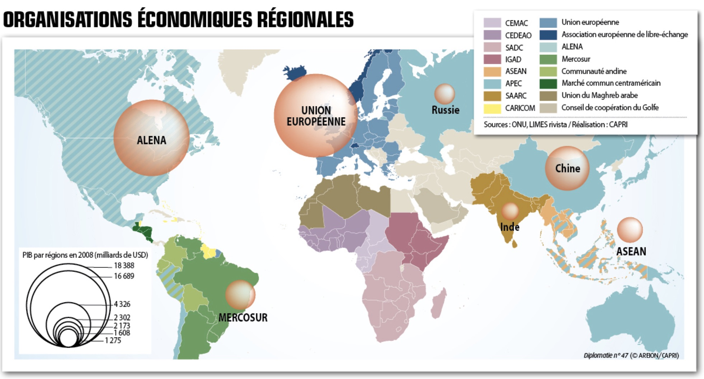
</div>

- Une vision simple et rassurante de blocs économiques bien séparés où les pays occidents pèsent le plus sur le plan économique.
Source : Diplomatie, n°47

## Régionalisme : situation vers 2020

<div class="centered">
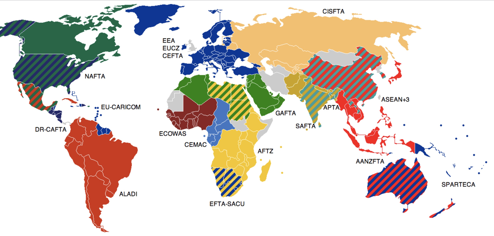
</div>

- Une vision complexe de zones de libre échanges multiples qui se chevauchent et s'intersectent sans logique claire. 
Source : Wikipedia, english, consulté le 8 mars 2022


## Le conflit russo-ukrainien de 2013-2014 

- Le conflit russo-ukrainien de 2013-2014 qui aboutit à l'annexion de la Crimée et la première guerre du Donbass  trouve son point de départ dans un **arbitage géopolitique entre deux visions de l'intégration régionale du pays dans le Monde**. 

- **La Communauté des États indépendants (CEI) ** signe un accord de libre-échange signé le 18 octobre 2011 entre la **Russie, l'Ukraine, la Biélorussie, la Moldavie, l'Arménie, le Kirghizstan et le Kazakhstan** afin de renforcer les échanges entre les pays. Mais sa ratification prend du temps et n'est pas achevée en 2013 et sera abandonnée.

- **L'Union Européenne** de son côté propose à l'Ukraine un **accord d'association** qui est négocié de 2007 à 2012 pour entrer en vigueur en novembre 2013. Mais le président ukrainien **Vladimir Ianoukovitch** refuse de le ratifier ce qui provoque les événements de Maïdan, suivi de sa destitution et sa fuite en Russie. L'Ukraine rejoint l'accord avec l'UE en 2017.

## Le conflit russo-ukrainien de 2013-2014

<div class="centered">
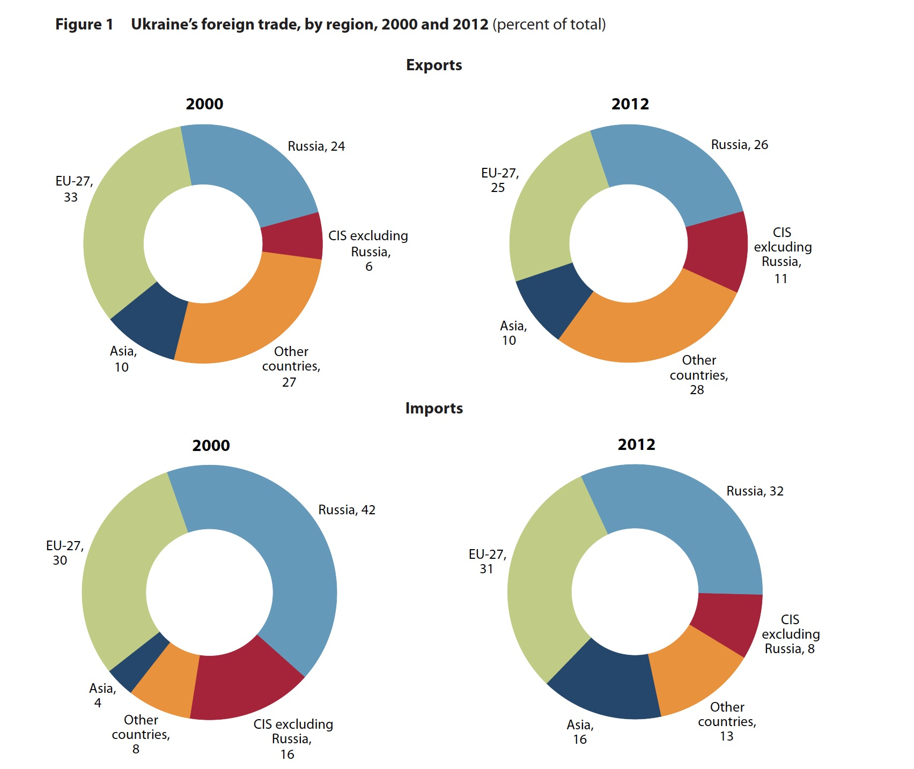
</div>

- Quelques semaines avant le conflit, un document d'analyse économique s'interroge sur le choix de l'Ukraine qui commerce à part approximativement égale avec les deux blocs. 

Source : Anders Aslund, Sept. 2013, "Ukraine’s Choice: European Association Agreement or Eurasian Union?", Policy Brief  n°22 of the Peterson Institute for International Economics. [Lien](https://www.google.com/url?sa=t&rct=j&q=&esrc=s&source=web&cd=&ved=2ahUKEwjy9MCmz7b2AhVGQhoKHSAYDRIQFnoECAcQAQ&url=https%3A%2F%2Fciaotest.cc.columbia.edu%2Fpbei%2Fiie%2F0029281%2Ff_0029281_23772.pdf&usg=AOvVaw2OXIaF69c9eqbWlXGpdqmn)


## Du régionalisme à l'intégration régionale


- **Le politiste Joseph Nye (1968)** discute le concept d’**intégrations régionales** et propose d’étudier en parallèle dans une partie du monde donnée l’intégration **économique**, l’intégration **sociale** et l’intégration **politique**, chacun de ces types d’intégration pouvant à son tour être divisé en sous-types (Nye, 1968) et entrer en interaction avec les autres.

- **L'économiste H. Regnault (1986)** pense que le régionalisme peut correspondre "à un besoin de relations étroites en vue de former bloc au sein de l’économie mondiale. Cela implique l’engagement dans un processus d’**intégration en profondeur**. Outre la proximité géographique, l’exclusivité de la relation suppose « **un vouloir vivre ensemble** » ou, au minimum, la **conscience d’un « devoir vivre ensemble **», ce qui en fait un projet géopolitique global, non réductible à la seule logique économique .


## L'intégration régionale : définition

- L’**intégration régionale désigne un processus de création, d’accroissement et d’approfondissement des interactions entre des unités territoriales initialement distinctes et contiguës**. 

- Le processus aboutit à la formation d’un **ensemble régional autonome** à l’intérieur duquel les interactions entre les territoires constitutifs sont plus fortes qu’avec les territoires externes. Les ensembles régionaux ainsi construits peuvent être de toutes tailles. 

- Ils peuvent être constitués par les territoires additionnés de plusieurs **pays contigus**, ou former des **ensembles transnationaux** déployés sur le territoire de plusieurs États sans nécessairement inclure ceux-ci en entier, pourvu qu’il n’y ait pas de rupture de la **continuité spatiale**

Source : Y. Richard, 2014, "Régionalisation, régionalisme et intégration régionale : concepts flous et nécessaire clarification", in [Richard Y. & Gana A., 2014](https://www.cairn.info/la-regionalisation-du-monde--9782811111403-page-21.htm)

## En résumé :

1. la **régionalisation** est la mise en évidence d'espace voisins ou proches ayant plus de liens entre eux qu'avec le reste du Monde et/ou qui renforcent ces liens. Elle relève donc d'une **analyse économique et géographique** de l'organisation du Monde par les **flux**.  

2. Le **régionalisme** est un processus **politique et juridique** de création de territoires de circulation préférentielle qui favorisent les échanges entre des lieux proches en réduisant les distances et abolissant les frontières. 

3. L'**intégration régionale* ** est le résultat de la combinaison dialectique des deux processus précédents. L'existence de flux ou de liens entre pays proches (*régionalisation*) peut conduire ceux-ci à mettre en place une structure politique (*régionalisme*) qui va contribuer en retour à renforcer les flux. 

4. Si la **dimension économique** est la plus souvent mise en avant, les processus d'intégration régionale sont **multifactoriels** et combinent aussi bien des dimensions objectives (e.g. complémentarités) que des dimensions subjectives (e.g. sentiments d'identités)


